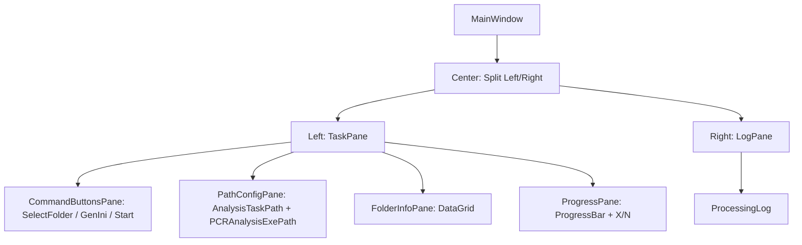

# AutoAnalysisTaskFeeder（WPF）規格書章節大綱（精簡版 / 依新版 GUI 更新）

> 目的：建立自動化解析實驗資料後生成 Analysis 程式執行所需的 ini 檔案，並能自動啟動分析程式、監視分析結束狀態，持續匯入下一筆 ini 檔，直到所有實驗資料分析完成。  
> 框架假設：.NET（建議 6/8）+ WPF + MVVM（CommunityToolkit.Mvvm 或 Prism 皆可）。

---

## 1. 文件資訊
- 版本紀錄  
  ❇️Version : Ver0.2  
  ❇️Date : 2025/12/30  
  ❇️Author : Albert Ke

- 名詞定義及說明
  1. **AnalysisTask 目錄**  
     目錄位置為 `TextBoxAnalysisTaskPath` 內所顯示的字串。可由使用者按下 `btnAnalysisTaskPath` 選取目錄後自動帶入，或由使用者自行輸入。  
     目錄架構如下：
     ```text
     AnalysisTask/
     ├─ Complete/
     ├─ History/
     └─ New/
     ```
     - `New`：將 `NewAnalysis.ini` 放入此目錄後會觸發分析程式 `QKBqPCRAnalysis.exe` 對實驗資料進行分析。
     - `Complete`：分析完成後，分析程式會將 `NewAnalysis.ini` 搬移至此目錄，約 3 分鐘後再移至 `History`。
     - `History`：用來記錄已完成的分析資料（本程式不使用此目錄，但需保留以符合外部程式行為）。

  2. **QKBqPCRAnalysis.exe**  
     實驗資料分析所需程式。路徑為 `TextBoxPCRAnalysisPath` 內所顯示的字串，可由 `btnPCRAnalysisPath` 選取後帶入，或由使用者自行輸入。  
     執行後（依外部程式行為）會清除 `New` 與 `Complete` 內檔案，並監控 `New` 目錄下是否出現新的 `NewAnalysis.ini`。

  3. **NewAnalysis.ini**  
     範例內容：
     ```ini
     [Information]
     Enabled=1
     TotalCycle=40
     Flag=0
     TotalChip=6
     Path=R:\EDD_Software\SPR01v1\data ReDoAnalyze\202512191409_QSR2005_Interfere Hemo+EtOH
     User=Admin
     Filter=FAM::ROX:
     ```
     **需要動態修改的欄位：**
     - `TotalCycle`  
       來源：實驗目錄下名稱格式為 `PROG_xxxxx.ini`（`xxxxx` 變動）檔案內 `[qPCRSetting]` 的 `Cycle` 值。  
       ```ini
       [qPCRSetting]
       Cycle = 40
       ```
     - `TotalChip`  
       來源：實驗目錄下名稱格式為 `xxx_Note.json`（`xxx` 變動）檔案內 property `"Filter Selection"` 的陣列元素數。  
       - `TotalChip = length($["Filter Selection"])`
       ```json
       "Filter Selection": [
         "FAM::ROX::",
         "FAM::ROX::"
       ]
       ```
     - `Filter`  
       來源：同一份 `xxx_Note.json` 內 property `"Filter Selection"` 的第 1 筆元素，並轉換為 ini 所需格式。  
       - `raw = $["Filter Selection"][0]`
       - `Filter = NormalizeFilter(raw)`  
       - `NormalizeFilter("FAM::ROX::") -> "FAM::ROX:"`（將尾端 `::` 正規化為 `:`）
     - `Path`  
       由使用者按下 `btnSelectFolder` 選取之實驗資料目錄（可複選）。每個實驗目錄對應產生一份 `NewAnalysis.ini`。

  4. **ProcessingLog**  
     用來顯示程式執行過程的 log 訊息，以利除錯與追蹤外部程式執行狀態。

---

## 2. 系統範圍與成功標準
- 範圍：設定路徑（AnalysisTask / QKBqPCRAnalysis.exe）→ 選取實驗資料目錄 → 建立任務清單 → 產生 `NewAnalysis.ini` → 啟動分析(QKBqPCRAnalysis.exe) → 監看Complete目錄確認分析是否完成 → 關閉分析(QKBqPCRAnalysis.exe) → 顯示進度與 Log
- 不在範圍：分析演算法本體（本程式僅負責觸發/監控）
- 驗收：主流程可完成、UI 不凍結、錯誤可追蹤（Log + 提示）

---

## 3. 技術與架構（WPF 最小集合）
- 模式：MVVM  
  - View：MainWindow.xaml  
  - ViewModel：MainViewModel  
  - Service：FolderScanService / IniService / ProcessRunner / LogService
- 執行緒：掃描/分析使用 `Task`，以 `IProgress` 或 `Dispatcher` 更新 UI
- 資料繫結：`ObservableCollection` + `ICommand`（RelayCommand）

---

## 4. UI 佈局規格


### 4.1 版面結構（MainWindow）
- 左側：TaskPane
  - 上：CommandButtonsPane（3 個主要動作按鈕）
  - 中：PathConfigPane（2 組路徑：AnalysisTask Folder / QKBqPCRAnalysis.exe）
  - 下：FolderInfoPane（DataGrid：目錄列表）
  - 底：ProgressPane（ProgressBar + X/N）
- 右側：LogPane（ProcessingLog）



### 4.2 控制項命名（對應新版圖面編號）
- (1) `btnSelectFolder`：測試資料目錄選取
- (2) `btnGenIni`：產生 NewAnalysis.ini
- (3) `btnStart`：啟動自動分析
- (4) `btnAnalysisTaskPath`：選取 AnalysisTask Folder Path
- (5) `btnPCRAnalysisPath`：選取 QKBqPCRAnalysis.exe Path
- (6) `TextBoxAnalysisTaskPath`：顯示/輸入 AnalysisTask Folder Path
- (7) `TextBoxPCRAnalysisPath`：顯示/輸入 QKBqPCRAnalysis.exe Path
- (8) `dgTasks`：目錄列表（任務清單 DataGrid）
- (9) `pbProgress`：ProgressBar
- (10) `lblCount`：X/N（已處理目錄數/總數）
- (11) `tbLog`：ProcessingLog（TextBox / RichTextBox）

---

## 5. DataGrid 資料模型（TaskItem）
### 5.1 欄位（對應 GUI 欄位）
- `Index`（Item）
- `FolderName`
- `Machine`
- `App`
- `SoftwareVersion`
- `TotalCycle`（int?）
- `TotalChip`（int?）
- `Filter`（string：例 `FAM::ROX:`）
- `Status`（Pending / IniGenerated / Running / Success / Failed / Skipped）

### 5.2 繫結
- `ObservableCollection<TaskItem> Tasks`
- `IList SelectedTasks`（支援多選）或 `TaskItem? SelectedTask`

---

## 6. 命令與互動規格（ICommand）
### 6.1 命令清單（新版）
- `SelectFolderCommand`（btnSelectFolder）
- `GenerateIniCommand`（btnGenIni）
- `StartAnalysisCommand`（btnStart）
- `SelectAnalysisTaskPathCommand`（btnAnalysisTaskPath）
- `SelectPCRAnalysisPathCommand`（btnPCRAnalysisPath）

### 6.2 主流程（Happy Path）
1) 設定 `AnalysisTaskPath` 與 `PCRAnalysisExePath`（可由按鈕選取或手動輸入）  
2) SelectFolder → 掃描/解析 → 填入 DataGrid → 設定 N  
3) GenerateIni → 依選取列（或全部）產生 ini → 更新 Status  
4) StartAnalysis → 逐筆投遞 `NewAnalysis.ini` 至 `AnalysisTask\New` → 監控外部程式處理結果 → 更新 Progress + Log → 完成後彙總

---

## 7. 狀態與可用性規則（精簡）
- 路徑欄位（TextBox）允許手動編輯；點選按鈕可覆蓋/更新該 TextBox 值
- 初始：可設定兩個 Path；`btnSelectFolder` 可用；`btnGenIni`/`btnStart` 依條件啟用
- `btnGenIni` 啟用條件：DataGrid 任務數 > 0 且必要檔案可解析
- `btnStart` 啟用條件：至少一筆 ini 產生成功 + `PCRAnalysisExePath` 合法 + `AnalysisTaskPath` 合法
- 執行中（`IsBusy = true`）：所有路徑按鈕與主要按鈕 Disabled（避免在執行中改路徑造成不一致）

---

## 8. Log 規格（ProcessingLog）
- 格式：`[yyyy-MM-dd HH:mm:ss.fff] [LEVEL] message`
- 等級：INFO / WARN / ERROR
- 行為：只讀、可複製、可選擇是否自動捲到底
- 容量：上限行數（例如 5000），超過採 FIFO 刪除（避免卡頓）

---

## 9. 檔案/路徑與外部程式（最小必要）
- `AnalysisTaskPath`（TextBoxAnalysisTaskPath）
  - 必須包含 `New/Complete/History`（不存在則可由本程式建立，或提示使用者修正）
- `PCRAnalysisExePath`（TextBoxPCRAnalysisPath）
  - 必須為存在之 `QKBqPCRAnalysis.exe` 完整路徑
- INI 產生與投遞
  - 每個 Task 產生一份對應 `NewAnalysis.ini`
  - 投遞時寫入 `AnalysisTaskPath\New\NewAnalysis.ini`（覆寫策略需定義：建議寫入前先檢查並等待 New 目錄清空/或使用唯一檔名）

---

## 10. 非功能性（精簡）
- UI 不凍結：掃描/分析必須 async
- 錯誤可追：所有例外必須寫入 Log，並以 MessageBox 提示摘要
- 相容：中文路徑、長路徑、無權限時的處理

---

## 11. 測試檢核表（可直接轉工單）
- UI：Resize、左右 Split、DataGrid 捲動、Log 自動捲動
- Path：可手動輸入、可按按鈕選取、非法路徑提示與禁止啟動
- 流程：設定路徑→選目錄→產生 ini→啟動分析
- 錯誤：空目錄/無權限/INI 讀寫失敗/外部程式不存在/外部程式回傳異常
- 壓力：大量任務（例如 500~5000）、長 Log

---

## 附錄 A：最小 ViewModel 欄位清單（便於 AI 生成）
- `string AnalysisTaskPath`
- `string PCRAnalysisExePath`
- `ObservableCollection<TaskItem> Tasks`
- `IList SelectedTasks` / `TaskItem? SelectedTask`
- `string LogText`
- `int TotalCount`
- `int ProcessedCount`
- `double ProgressValue`（0~100 或 0~N）
- `bool IsBusy`
- Commands：`SelectFolderCommand / GenerateIniCommand / StartAnalysisCommand / SelectAnalysisTaskPathCommand / SelectPCRAnalysisPathCommand`
