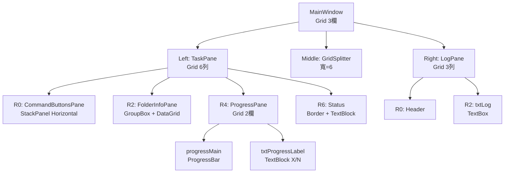

# AutoAnalysisTaskFeeder（WPF）規格書章節大綱（精簡版 / 依新版 GUI 更新）

> 目的：建立自動化解析實驗資料後生成 Analysis 程式執行所需的 ini 檔案，並能自動啟動分析程式、監視分析結束狀態，持續匯入下一筆 ini 檔，直到所有實驗資料分析完成。  
> 框架假設：.NET（建議 6/8）+ WPF + MVVM（CommunityToolkit.Mvvm 或 Prism 皆可）。

---

## 1. 文件資訊
- 版本紀錄  
  ❇️Version : Ver0.4  
  ❇️Date : 2026/01/19  
  ❇️Author : Albert Ke
  > **修改紀錄**：
  > - Ver0.3 (2026/01/13): 根據 GUISpec.drawio 及 Layout.xml 實際 UI 設計更新規格書，修正控制項命名、列名、結構等細節
  > - Ver0.4 (2026/01/19): 新增資料夾多選功能，使用 Ookii.Dialogs.Wpf 套件支援；修正關鍵缺陷（Path/User 欄位、副本 INI、User Name 解析、MessageBox 反饋、確認對話框）

- 名詞定義及說明
  1. **AnalysisTask 目錄**  
     目錄位置為 `TextBoxAnalysisTaskPath` 內所顯示的字串。可由使用者按下 `btnAnalysisTaskPath` 選取目錄後自動帶入，或由使用者自行輸入。  
     目錄架構如下：
     ```text
     \AnalysisTask/
      ├─ Complete/
      ├─ History/
      └─ New/
     ```
     - `New`：將 `NewAnalysis.ini` 放入此目錄後會觸發分析程式 `QKBqPCRAnalysis.exe` 對實驗資料進行分析。
     - `Complete`：分析完成後，分析程式會將 `NewAnalysis.ini` 搬移至此目錄，約 3 分鐘後再移至 `History`。
     - `History`：用來記錄已完成的分析資料（本程式不使用此目錄，但需保留以符合外部程式行為）。

  2. **QKBqPCRAnalysis.exe**  
     實驗資料分析所需程式。路徑為 `TextBoxPCRAnalysisPath` 內所顯示的字串，可由 `btnPCRAnalysisPath` 選取後帶入，或由使用者自行輸入。  
     執行後（依外部程式行為）會清除 `New` 與 `Complete` 內檔案，並監控 `New` 目錄下是否出現新的 `NewAnalysis.ini`。

  3. **NewAnalysis.ini**（由本程式產生）  
     完整格式定義：
     ```ini
     [Information]
     Enabled=1
     TotalCycle=<整數，範圍 1~100>
     Flag=0
     TotalChip=<整數，6>
     Path=<實驗資料目錄完整路徑>
     User=<使用者名稱>
     Filter=<篩選器，格式如 FAM::ROX: 或 FAM:HEX:ROX:CY5:>
     ```
     
     **動態欄位讀取與計算規則：**
     
     - **`TotalCycle`**  
       - 來源：實驗目錄下 `PROG_*.ini` 檔案內 `[qPCRSetting]` 段的 `Cycle` 鍵值
       - 搜尋規則：glob 模式 `PROG_*.ini`（UTF-8 編碼，大小寫敏感），若多筆存在取修改時間最新者
       - 值型別：整數（若非整數或無此鍵則記錄 WARN，填 0）
       - 值域驗證：1~100（超出範圍記錄 WARN，採用實際值）
       - 範例：`Cycle = 40` → `TotalCycle=40`
     
     - **`TotalChip`**  
       - 來源：實驗目錄下 `*_Note.json` 檔案（UTF-8 編碼）的 `"Filter Selection"` 陣列長度
       - 搜尋規則：glob 模式 `*_Note.json`（大小寫敏感），若多筆存在取修改時間最新者
       - 計算邏輯：`TotalChip = $["Filter Selection"].Count()`
       - 邊界情況：若陣列為空或缺失，記錄 ERROR，填 0，跳過該任務
       - 實際範例：陣列長度為 6 → `TotalChip=6`
     
     - **`Filter`**  
       - 來源：同一份 `*_Note.json` 的 `"Filter Selection"[0]`（第一個元素）
       - 轉換邏輯：`raw = $["Filter Selection"][0]` → `Filter = NormalizeFilter(raw)`
       - **NormalizeFilter 演算法**：將尾端連續的 `:` 合併為單個 `:` 
         ```
         NormalizeFilter(raw):
           result = raw.TrimEnd()
           while result.EndsWith("::"):
             result = result.Substring(0, result.Length - 1)
           return result
         ```
         - 範例 1：`"FAM::ROX::"` → `"FAM::ROX:"`
         - 範例 2：`"FAM:HEX:ROX:CY5:"` → `"FAM:HEX:ROX:CY5:"`（已是單冒號結尾）
         - 範例 3：`"FAM::ROX:::"` → `"FAM::ROX:"`（多重尾端冒號）
         - 邊界：若 raw 為 null 或空字串，填 "" 或記錄 WARN
       - 實際範例：`"FAM::ROX::"` → `Filter=FAM::ROX:`；`"FAM:HEX:ROX:CY5:"` → `Filter=FAM:HEX:ROX:CY5:`
     
     - **`Path`**  
       - 來源：使用者按下 `btnSelectFolder` 選取之實驗資料目錄完整路徑
       - 格式：Windows 路徑（支援長路徑 32767 字符、中文、特殊字符）
       - 範例：`E:\QuarkBio\JobData\Test_Data\Admin\202411111428_QSR2007_QSR2007-FQC1 test`
     
     - **`User`**  
       - 來源：`*_Note.json` 的 `"User Name"` 字串
       - 範例：`"Admin"`
       - 若缺失：填 "Unknown" 並記錄 WARN
     
     - **`Enabled` 和 `Flag`**  
       - 固定值：`Enabled=1`，`Flag=0`（本程式不修改）

  4. **ProcessingLog**  
     用來顯示程式執行過程的 log 訊息，以利除錯與追蹤外部程式執行狀態。

---

## 2. 系統範圍與成功標準
- 範圍：設定路徑（AnalysisTask / QKBqPCRAnalysis.exe）→ 選取實驗資料目錄 → 建立任務清單 → 產生 `NewAnalysis.ini` → 啟動分析(QKBqPCRAnalysis.exe) → 監看Complete目錄確認分析是否完成 → 關閉分析(QKBqPCRAnalysis.exe) → 顯示進度與 Log
- 不在範圍：分析演算法本體（本程式僅負責觸發/監控/關閉）
- 驗收：主流程可完成、UI 不凍結、錯誤可追蹤（Log + 提示）

---

## 3. 技術與架構（WPF 最小集合）
- 模式：MVVM  
  - View：MainWindow.xaml  
  - ViewModel：MainViewModel  
  - Service：FolderScanService / IniService / ProcessRunner / LogService
- 執行緒：掃描/分析使用 `Task`，以 `IProgress` 或 `Dispatcher` 更新 UI
- 資料繫結：`ObservableCollection` + `ICommand`（RelayCommand）
- **NuGet 套件依賴**：
  - `CommunityToolkit.Mvvm` v8.2.2+ - MVVM 框架支援
  - `Ookii.Dialogs.Wpf` v5.0.1+ - 多選資料夾對話框

---

## 4. UI 佈局規格


### 4.1 版面結構（MainWindow）
- **整體結構**：3 欄 Grid 配置（3 * 寬度比例 = `3* : 6 : 2*`）
  - 左側（Grid.Column="0"）：TaskPane（主任務區域）
  - 中間（Grid.Column="1"）：GridSplitter（寬度=6，可調整寬度）
  - 右側（Grid.Column="2"）：LogPane（日誌區域）

- **左側 TaskPane（6 列 Grid）：**
  - Row 0：CommandButtonsPane（命令按鈕）
  - Row 1：12px 間距
  - Row 2：FolderInfoPane（DataGrid）- 填充區域（Height="*"）
  - Row 3：14px 間距
  - Row 4：ProgressPane（進度條）
  - Row 5：10px 間距
  - Row 6：Status 顯示（就緒狀態文字）

- **右側 LogPane（3 列 Grid）：**
  - Row 0：Header "ProcessingLog"
  - Row 1：10px 間距
  - Row 2：日誌文字框（填充區域）



### 4.2 控制項命名（對應 GUISpec.drawio 及 Layout.xml）

**【修改】控制項命名已根據 Layout.xml 實際 XAML 代碼更正：**

#### CommandButtonsPane（Row 0）
- `btnSelectFolder`：測試資料目錄選取（按鈕，寬=內容+Padding）
- `btnGenIni`：產生 NewAnalysis.ini（按鈕）
- `btnStart`：啟動自動分析程式（按鈕）

#### PathConfigPane（隱含於 FolderGrid 上方）

- Row 1（AnalysisTask Folder 行）：
  - `btnAnalysisTaskPath`：按鈕（寬度固定）
  - `TextBoxAnalysisTaskPath`：文字框（可編輯）
  
- Row 2（QKBqPCRAnalysis.exe Path 行）：
  - `btnPCRAnalysisPath`：按鈕（寬度固定）
  - `TextBoxPCRAnalysisPath`：文字框（可編輯）


#### FolderInfoPane（Row 2）
- `gridFolders`：DataGrid，AutomationId = "gridFolders"
  
**【修改】DataGrid 列名已根據 Layout.xml 實際列定義更正：**

  | 欄位名稱 | Binding | 寬度 | 說明 |
  |---------|---------|------|------|
  | Item | Item | 60 | 編號（原 v0.2 誤稱 Index） |
  | Folder Name | FolderName | \* | 資料夾名稱 |
  | Machine | Machine | 90 | 機器名稱 |
  | APP | App | 70 | **【修改】v0.2 為 "App"，實際 XAML 列頭為 "APP"** |
  | Software Version | SoftwareVersion | 120 | 軟體版本 |
  | TotalCycle | TotalCycle | 90 | 總循環數 |
  | TotalChip | TotalChip | 90 | 晶片總數 |
  | Filter | Filter | 90 | 濾光片配置 |


#### ProgressPane（Row 4）
- **子 Grid 2 欄：**
  - Col 0：`progressMain`（ProgressBar，寬度 \*）
    - AutomationId = "progressMain"
    - 高度 = 20
    - Minimum = 0, Maximum = 100
  - Col 1：`txtProgressLabel`（TextBlock，寬度 160）
    - AutomationId = "txtProgressLabel"
    - 內容：進度標籤，例 "5/10"（已處理數/總數）
    - **【修改】v0.2 稱為 `lblCount`，實際為 `txtProgressLabel`**

#### Status（Row 6）
- `txtStatus`：TextBlock（Border 內）
  - AutomationId = "txtStatus"
  - 初值 = "Ready"
  - ToolTip = "目前狀態：Ready / Running / Completed / Error"

#### LogPane（Right Pane）
- Row 0 Header：`lblProcessingLog`（TextBlock，自動化 ID）
  - 文字 = "ProcessingLog"
- Row 2：`txtLog`（TextBox）
  - AutomationId = "txtLog"
  - 內容：ProcessingLog（只讀）
  - AcceptsReturn = True
  - TextWrapping = NoWrap
  - VerticalScrollBarVisibility = Auto
  - HorizontalScrollBarVisibility = Auto

---

## 5. DataGrid 資料模型（TaskItem）

### 5.1 欄位（對應 GUI 欄位 + 內部狀態）

**【修改】根據實際 DataGrid 列定義，列名如下：**

#### 顯示於 UI 的欄位（8 個）
- `Item`（int）：序號
- `FolderName`（string）：資料夾名稱
- `Machine`（string）：機器代碼（來自 JSON `"Machine Code"`）
- `App`（string）：應用名稱（來自 JSON `"Program Name"`）
- `SoftwareVersion`（string）：軟體版本（來自 JSON `"Software Version"`）
- `TotalCycle`（int?）：總循環次數（來自 INI `[qPCRSetting] Cycle`，可為 null）
- `TotalChip`（int?）：晶片總數（來自 JSON `"Filter Selection"` 陣列長度，可為 null）
- `Filter`（string）：篩選器配置（來自 JSON `"Filter Selection"[0]` 經 NormalizeFilter，可為 null 或 ""）

#### 內部狀態欄位（不顯示於 UI，但用於追蹤與控制流程）
- `Status`（TaskStatus 列舉）：任務狀態，值為 `Pending / Generating / IniGenerated / Running / Completed / Failed`
- `ErrorMessage`（string?）：若失敗，記錄失敗原因（例 "JSON 檔案不存在" / "無法讀取 Cycle 值"）
- `IniFilePath`（string?）：已產生的 INI 檔案完整路徑（例 `C:\AnalysisTask\New\NewAnalysis.ini`）
- `GeneratedTime`（DateTime?）：INI 產生時間
- `CompletedTime`（DateTime?）：分析完成時間
- `ProcessId`（int?）：外部程式進程 ID（用於監控與終止）

#### 列舉定義
```csharp
public enum TaskStatus
{
  Pending = 0,          // 初始狀態，未處理
  Generating = 1,       // 正在產生 INI
  IniGenerated = 2,     // INI 已產生，待執行
  Running = 3,          // 正在執行分析
  Completed = 4,        // 分析完成
  Failed = 5            // 失敗（含產生失敗與執行失敗）
}
```

### 5.2 繫結

- `ObservableCollection<TaskItem> Tasks`
- 選取方式：支援多選（DataGrid 預設行為）或單選

### 5.3 資料來源與填充流程

- 來源：由 `btnSelectFolder` 選取的實驗資料夾集合。每個資料夾解析後形成一筆 `TaskItem`（欄位對應 5.1）。
  
- **掃描與解析邏輯：**
  1. 使用者選取一或多個資料夾（多選）
  2. 對每個資料夾掃描以下檔案：
     - `PROG_*.ini`（glob 模式，大小寫敏感）
     - `*_Note.json`（glob 模式，大小寫敏感）
  3. 掃描範圍：**單層目錄**（不遞迴子資料夾）
  4. 若某資料夾不存在或無讀取權限，記錄 ERROR，跳過該資料夾
  
- **欄位解析規則：**
  - `FolderName`：資料夾名稱（Path.GetFileName）
  - `Machine`：讀取 `*_Note.json`→`"Machine Code"`；若不存在則填 "N/A"，記錄 WARN
  - `App`：讀取 `*_Note.json`→`"Program Name"`；若不存在則填 "N/A"，記錄 WARN
  - `SoftwareVersion`：讀取 `*_Note.json`→`"Software Version"`；若不存在則填 "N/A"，記錄 WARN
  - `TotalCycle`：讀取 `PROG_*.ini`→`[qPCRSetting] Cycle`
    - **多筆檔案處理**：若目錄內有多個 `PROG_*.ini`，取修改時間（LastWriteTime）最新的；記錄 WARN 訊息
    - **值驗證**：檢查是否整數、是否在 1~100 之間；若格式錯誤則填 null，記錄 WARN；若缺失鍵則填 null，記錄 WARN
  - `TotalChip`：讀取 `*_Note.json`→`"Filter Selection"` 陣列長度
    - **多筆檔案處理**：若目錄內有多個 `*_Note.json`，取修改時間最新的；記錄 WARN
    - **值驗證**：若陣列為空或缺失，填 null，記錄 ERROR；若元素非字串則跳過該元素，記錄 WARN
  - `Filter`：讀取 `*_Note.json`→`"Filter Selection"[0]`，經 NormalizeFilter 轉換
    - **邊界**：若陣列為空或缺失，填 ""，記錄 WARN
    - **轉換失敗**：若 NormalizeFilter 拋例外（字串為 null），填 ""，記錄 ERROR
  
- **刷新時機：**
  - 執行 `SelectFolderCommand` 成功後，清空舊 `Tasks` 重建新集合；重算 N、重置進度
  - 若使用者再次選取資料夾，呈現確認對話框："現有列表包含 N 個任務，是否清除？ (Yes: 覆寫 / No: 取消)"
    - 若覆寫：檢查是否有已生成 INI 的任務；若有，提示："部分任務已生成 INI，是否刪除 INI 檔案？ (Yes / No)"
    - Yes：刪除 AnalysisTask\New 內的對應 INI 檔案，再清空 Tasks 並掃描新資料夾
    - No：保留 INI，清空 Tasks 並掃描新資料夾
  
- **失敗處理：**
  - 單一資料夾解析失敗時，該筆以 Status=Failed、ErrorMessage=失敗原因 標記；不中斷其他資料夾的掃描
  - 所有資料夾都掃描完畢後，統計結果：成功數 / 失敗數 / 總數
  - 若全部失敗，維持空清單，呈現 MessageBox："無法解析任何選取的資料夾。詳見 Log。"
  - 若部分失敗，呈現 MessageBox："5 個中 3 個成功，2 個失敗。詳見 Log。"
  - 成功的任務 Status 初始化為 `Pending`，等待後續 GenerateIni 或 StartAnalysis 命令

---

## 6. 命令與互動規格（ICommand）

### 6.1 命令清單

- `SelectFolderCommand`（btnSelectFolder）
- `GenerateIniCommand`（btnGenIni）
- `StartAnalysisCommand`（btnStart）
- `SelectAnalysisTaskPathCommand`（btnAnalysisTaskPath）
- `SelectPCRAnalysisPathCommand`（btnPCRAnalysisPath）

### 6.2 主流程（Happy Path）

1) 設定 `AnalysisTaskPath` 與 `PCRAnalysisExePath`（可由按鈕選取或手動輸入）  
2) SelectFolder → 掃描/解析 → 填入 DataGrid → 設定 N  
3) GenerateIni → 依選取列（或全部）產生 ini → 更新 Status  
4) StartAnalysis → 逐筆投遞 `NewAnalysis.ini` 至 `AnalysisTask\New` → 監控外部程式處理結果 → 更新 Progress + Log → 完成後彙總

### 6.3 按鍵行為（互動細節）

- **`btnSelectFolder`**
  - 動作：開啟資料夾選取對話框（**支援多選**），掃描與解析選取的實驗資料夾，將結果填入 DataGrid；重算 N、重置進度為 0/0
  - 執行流程：
    1. 開啟資料夾對話框（**使用 Ookii.Dialogs.Wpf.VistaFolderBrowserDialog 支援多選**；起始目錄為上次選取位置，若無則為預設位置）
    2. 若選取被取消，無動作；若已選取，檢查是否需覆寫現有清單
    3. 若 Tasks 非空，呈現確認對話框："現有列表包含 {N} 個任務，是否清除？" (Yes / No / Cancel)
       - Yes：檢查是否有 Status=IniGenerated 的任務；若有，再次提示 "部分任務已生成 INI，是否同時刪除 INI 檔案？" (Yes / No)
         - Yes：遍歷 Tasks，將 Status=IniGenerated 的任務對應的 IniFilePath 檔案刪除（捕獲異常並記錄 WARN），再清空 Tasks
         - No：直接清空 Tasks，保留 INI 檔案
       - No / Cancel：中止此次操作，保留現有 Tasks
    4. 執行後台掃描任務（TaskAsync）：遍歷**所有選取的資料夾**（支援多選），解析每個資料夾（參照 5.3 欄位解析規則）
    5. 掃描完畢，統計結果並更新 UI：
       - 若全成功：呈現 MessageBox "成功載入 {N} 個資料夾"，重置進度為 0/{N}，Tasks 狀態為 Pending
       - 若全失敗：呈現 MessageBox "無法解析任何選取的資料夾。詳見 Log。"，Tasks 為空
       - 若部分失敗：呈現 MessageBox "成功: {M}，失敗: {N-M}。詳見 Log。"，Tasks 包含成功與失敗的項目
  - 驗證/錯誤：選取失敗或解析失敗時記錄 ERROR/WARN 至 ProcessingLog，並呈現摘要 MessageBox
  - 可用性：IsBusy=true 時停用；執行期間禁用其他命令按鈕與路徑按鈕
  - Log 記錄：`[INFO] 已選取 {資料夾數量} 個資料夾` → `[INFO] 掃描資料夾開始` → ... → `[INFO] 掃描完畢: 成功 {M}，失敗 {N-M}，總計 {N} 個任務`；每個失敗項目記錄 `[WARN/ERROR] 解析失敗: {資料夾路徑} - {原因}`
  - **技術實現**：使用 `Ookii.Dialogs.Wpf` NuGet 套件 (v5.0.1+) 提供的 `VistaFolderBrowserDialog`，設定 `Multiselect = true` 以啟用多選功能；透過 `SelectedPaths` 屬性取得所有選取的資料夾路徑陣列

- **`btnGenIni`**
  - 前置條件：Tasks 中至少有一筆 Status=Pending 或 IniGenerated 的任務（**無需 AnalysisTaskPath 驗證**）
  - 動作：針對已選取列（無選取時預設全部）在**各實驗目錄根目錄下**產生 `NewAnalysis.ini` 檔案
  - 執行流程：
    1. 檢查前置條件：Tasks 非空；無需檢查 AnalysisTaskPath
    2. 若無選取列，預設選取全部 Tasks；若有選取列，僅處理選取的列
    3. 遍歷待處理的 Tasks，逐筆執行：
       - 更新 Status = Generating，更新 UI（可選：DataGrid 該列改變背景色或顯示動畫）
       - 讀取 JSON/INI 檔案，解析 TotalCycle / TotalChip / Filter（參照 5.3 規則，若讀取失敗記錄 WARN，採用 null/"" 填充）
       - 構建 NewAnalysis.ini 內容（參照第 1 章格式定義）
       - **寫入至實驗目錄根目錄**：將 INI 檔案寫入 `{FolderPath}\NewAnalysis.ini`
       - 若寫入成功：
         - 更新 Status = IniGenerated
         - 記錄 IniFilePath = `{FolderPath}\NewAnalysis.ini`
         - 記錄 GeneratedTime = DateTime.Now
         - 記錄 Log `[INFO] INI 已產生: {FolderPath}\NewAnalysis.ini`
       - 若寫入失敗（無權限、磁碟滿、路徑無效等）：
         - 更新 Status = Failed、ErrorMessage=具體原因（例 "無寫入權限"）
         - 記錄 Log `[ERROR] INI 產生失敗: {FolderPath} - {異常訊息}`
         - 繼續下一筆
    4. 全部任務處理完畢，統計結果並呈現 MessageBox：
       - 全成功："已成功產生 {N} 份 INI"
       - 全失敗："無法產生任何 INI。詳見 Log。"
       - 部分失敗："成功: {M}，失敗: {N-M}。詳見 Log。"
    5. 更新 ProcessedCount 與 ProgressBar
  - 可用性：IsBusy=true 時停用；執行期間禁用其他命令按鈕

- **`btnStart`**
  - 前置條件：至少一筆 Status=IniGenerated 的任務；`PCRAnalysisExePath` 存在且副檔名 .exe；`AnalysisTaskPath` 驗證通過
  - 動作：依序執行每筆 IniGenerated 的任務，啟動 QKBqPCRAnalysis.exe、投遞 INI、監控完成、關閉程式
  - 執行流程（同步逐筆執行）：
    1. 篩選 Status=IniGenerated 的任務清單，按 Item 順序排列
    2. 若清單為空，呈現 MessageBox "沒有待執行的任務。請先產生 INI。"，中止
    3. 設定 IsBusy=true，StatusMessage="Running"，禁用所有按鈕
    4. **對每一筆任務執行以下步驟：**
       
       **4.1 準備階段：**
       - 更新 Status = Running，ProcessedCount += 0（先更新 UI）
       - 記錄 Log `[INFO] 執行任務 {Item}/{TotalCount}: {FolderName}...`
       
       **4.2 啟動外部程式：**
       - 呼叫 `Process.Start(PCRAnalysisExePath)` **以管理員權限**啟動 QKBqPCRAnalysis.exe（設定 `ProcessStartInfo.Verb = "runas"`）
       - 若使用者拒絕 UAC 提示，記錄 ERROR Log，該任務標記為 Failed，繼續下一筆
       - 檢查程式啟動是否成功（若異常，記錄 ERROR Log，該任務標記為 Failed，繼續下一筆）
       - 記錄進程 ID 至 ProcessId
       - 記錄 Log `[INFO] 已啟動 QKBqPCRAnalysis.exe (PID={ProcessId})`
       - **重要：** 程式啟動時會自動清空 `AnalysisTaskPath\New\`、`Complete\`、`History\` 三個子目錄內所有的 ini 檔案
       - **等待 2 秒** 讓外部程式完成初始化和目錄清空動作
       - 記錄 Log `[INFO] 外部程式就緒，目錄已清空`
       
       **4.3 投遞 INI 檔案：**
       - 將 `{FolderPath}\NewAnalysis.ini`（已在實驗目錄下）複製至 `AnalysisTaskPath\New\NewAnalysis.ini`（供外部程式讀取）
       - 若複製失敗（無權限、檔案佔用等），記錄 ERROR Log，該任務標記為 Failed，關閉程式進程，繼續下一筆
       - 記錄 Log `[INFO] 已投遞 INI: {FolderName}`
       
       **4.4 監控完成：**
       - 進入監控迴圈：每 500ms 檢查一次
         - **主要監控**：檢查 `AnalysisTaskPath\Complete\NewAnalysis.ini` 是否存在
           - 檔案完成判定：檔案存在 + 修改時間戳連續 1 秒無變化（表示寫入完成）
         - **次要監控**：檢查 Process 狀態（根據 LabVIEW State Machine 特性）
           - 若 `Process.HasExited = true`：檢查 ExitCode
             - ExitCode = 0 且 INI 已移至 Complete → 正常完成
             - ExitCode ≠ 0 或 INI 未移至 Complete → State Machine 發生錯誤，標記為 Failed
           - 若 Process 無回應超過 1 分鐘 → 記錄 WARN
         - **超時時間**：15 分鐘（單筆任務，900 秒）
       - **成功情境**（檔案成功移至 Complete）：
         - 更新 Status = Completed、CompletedTime = DateTime.Now
         - ProcessedCount += 1，更新 ProgressBar 與 txtProgressLabel
         - 記錄 Log `[INFO] 任務完成: {FolderName} (耗時 {耗時秒數}s)`
         - **重要**：QKBqPCRAnalysis.exe 完成分析後不會自動退出，必須由本程式手動終止程序
       - **失敗情境**：
         - 若 Process 意外終止（HasExited=true 且 ExitCode≠0）：
           - 更新 Status = Failed、ErrorMessage="分析程式異常終止 (ExitCode={ExitCode})"
           - 記錄 ERROR Log `[ERROR] 程式異常終止: {FolderName} (ExitCode={ExitCode})`
         - 若 Process 已退出但 INI 未移至 Complete：
           - 更新 Status = Failed、ErrorMessage="分析程式已結束但 INI 未完成"
           - 記錄 ERROR Log
         - 若監控超時（15 分鐘）：
           - 更新 Status = Failed、ErrorMessage="監控超時，分析程式未完成"
           - 記錄 ERROR Log `[ERROR] 監控超時: {FolderName} (15 分鐘內未完成)`
         - 所有失敗情境後繼續下一步（關閉程式）
       
       **4.5 關閉程式：**
       - **重要**：QKBqPCRAnalysis.exe 完成分析後不會自動退出，必須手動終止
       - 呼叫 `Process.Kill()` 強制終止 QKBqPCRAnalysis.exe 程序
       - 若程序已意外結束（HasExited=true），跳過此步驟
       - 等待程序完全終止（最多 5 秒），若仍未終止則記錄 ERROR
       - 記錄 Log `[INFO] 已關閉 QKBqPCRAnalysis.exe`
       - **清理 New/Complete 目錄**（可選，建議由外部程式負責）：若 Complete 內存在 NewAnalysis.ini，可選擇刪除或保留，此項由設計決定
    
    5. **全部任務執行完畢：**
       - 統計結果：成功數 / 失敗數 / 總數
       - 設定 IsBusy=false
       - 若全成功：StatusMessage="Completed"，呈現 MessageBox "已完成分析 {N} 筆任務"
       - 若全失敗：StatusMessage="Error"，呈現 MessageBox "所有任務均失敗。詳見 Log。"
       - 若部分失敗：StatusMessage="Completed (with errors)"，呈現 MessageBox "成功: {M}，失敗: {N-M}。詳見 Log。"
       - 記錄 Log `[INFO] 分析流程完畢: 成功 {M}，失敗 {N-M}，耗時 {總耗時}s`
  
  - **取消功能（可選）：**
    - 執行 btnStart 期間，允許使用者按 ESC 鍵或點擊"取消"按鈕（若新增）中止流程
    - 取消時呈現確認對話框："是否中止分析？當前任務將標記為取消。" (Yes / No)
    - Yes：立即結束當前外部程式進程、停止監控迴圈、更新 Status="Cancelled"、StatusMessage="Cancelled"、記錄 Log
    - No：繼續執行
  
  - 可用性：IsBusy=true 時停用；執行期間禁用所有命令按鈕與路徑按鈕

- **`btnAnalysisTaskPath`**
  - 動作：開啟資料夾選取對話框，將選取結果寫入 `TextBoxAnalysisTaskPath`，並驗證路徑合法性
  - 驗證規則：
    1. 路徑必須存在（若不存在，提示："路徑不存在，請重新選取。"）
    2. 路徑必須具備讀取與寫入權限（測試建立臨時檔案；若失敗，提示："路徑無寫入權限。"）
    3. 必須包含 New / Complete / History 三個子資料夾
       - 若缺失，呈現對話框："子資料夾不完整，是否自動建立？ (Yes / No)"
       - Yes：嘗試建立缺失的子資料夾（若失敗記錄 ERROR，禁用 btnStart）
       - No：記錄 WARN，禁用 btnStart 直至路徑修正
  - 支援 UNC 路徑（如 `\\server\share\path`）與長路徑（32767 字符）
  - 失敗時提示 MessageBox 並寫入 ProcessingLog；同時禁用 btnStart（待路徑修正後再啟用）

- **`btnPCRAnalysisPath`**
  - 動作：開啟檔案選取對話框（Filter: `QKBqPCRAnalysis.exe`），將結果寫入 `TextBoxPCRAnalysisPath`
  - 驗證規則：
    1. 檔案必須存在
    2. 副檔名必須為 `.exe`（不區分大小寫）
    3. 檔案必須具備讀取權限與執行權限
  - 失敗時提示 MessageBox 並寫入 ProcessingLog；同時禁用 btnStart（待路徑修正後再啟用）

- **通用要求**
  - 所有按鍵啟用/停用依第 7 章「狀態與可用性規則」
  - 重要操作（開始/產生/路徑變更/錯誤）均需寫入 ProcessingLog，格式參照第 8 章
  - MessageBox 內容應清晰簡潔，若錯誤清單較長（>5 項），可提示"詳見 Log"而非列舉所有項目

---

## 7. 狀態與可用性規則

### 7.1 IsBusy 狀態與按鈕鎖定邏輯

- **初始狀態**（IsBusy=false）：
  - `btnSelectFolder`：啟用
  - `btnGenIni`：若 Tasks.Count > 0 且 AnalysisTaskPath 合法，啟用；否則停用
  - `btnStart`：若至少一筆 Status=IniGenerated 且 AnalysisTaskPath、PCRAnalysisExePath 皆合法，啟用；否則停用
  - `btnAnalysisTaskPath`、`btnPCRAnalysisPath`：啟用
  - `TextBoxAnalysisTaskPath`、`TextBoxPCRAnalysisPath`：可編輯

- **SelectFolder 執行期間**（IsBusy=true）：
  - `btnSelectFolder`、`btnGenIni`、`btnStart`：停用
  - `btnAnalysisTaskPath`、`btnPCRAnalysisPath`：停用
  - `TextBoxAnalysisTaskPath`、`TextBoxPCRAnalysisPath`：禁用編輯

- **GenerateIni 執行期間**（IsBusy=true）：
  - `btnSelectFolder`、`btnStart`：停用
  - `btnGenIni`：停用（自身執行中）
  - `btnAnalysisTaskPath`、`btnPCRAnalysisPath`：**啟用**（無相依性）
  - `TextBoxAnalysisTaskPath`、`TextBoxPCRAnalysisPath`：可編輯（無相依性）

- **StartAnalysis 執行期間**（IsBusy=true）：
  - `btnSelectFolder`、`btnGenIni`、`btnStart`：停用
  - `btnAnalysisTaskPath`、`btnPCRAnalysisPath`：停用
  - `TextBoxAnalysisTaskPath`、`TextBoxPCRAnalysisPath`：禁用編輯

### 7.2 路徑驗證與即時更新

- **AnalysisTaskPath 驗證**（TextBoxAnalysisTaskPath 失焦或按鈕變更後觸發）：
  1. 路徑存在性：若路徑不存在，TextBox 底部顯示紅色邊框 + 提示文本 "路徑不存在"，禁用 btnStart
  2. 寫入權限：測試在路徑下建立臨時檔案；若失敗，TextBox 底部顯示紅色邊框 + "無寫入權限"，禁用 btnStart
  3. 子資料夾檢查：檢查 New / Complete / History 是否存在；若缺失，提示 TextBox 下方 "子資料夾不完整"，可點選自動建立或手動修正
  4. 驗證成功：移除紅色邊框，恢復 btnStart 可用性（若其他條件也滿足）
  - 同步驗證：btnAnalysisTaskPath 點選後，路徑確認前即時驗證與回饋

- **PCRAnalysisExePath 驗證**（TextBoxPCRAnalysisPath 失焦或按鈕變更後觸發）：
  1. 檔案存在性：若不存在，TextBox 底部顯示紅色邊框 + "檔案不存在"，禁用 btnStart
  2. 副檔名驗證：若副檔名非 `.exe`（不區分大小寫），TextBox 底部顯示 "副檔名無效"，禁用 btnStart
  3. 執行權限：檢查檔案是否可執行（Windows 下通常自動允許 .exe）
  4. 驗證成功：移除紅色邊框，恢復 btnStart 可用性（若其他條件也滿足）

### 7.3 按鈕可用性條件矩陣

| 按鈕 | 初始 | SelectFolder | GenerateIni | StartAnalysis | 路徑驗證失敗 |
|------|------|--------------|-------------|---------------|----------|
| btnSelectFolder | ✓ | ✗ | ✗ | ✗ | ✓ |
| btnGenIni | Tasks > 0 | ✗ | ✗ | ✗ | ✗ |
| btnStart | IniGenerated > 0 | ✗ | ✗ | ✗ | ✗ |
| btnAnalysisTaskPath | ✓ | ✗ | ✗ | ✗ | ✓ |
| btnPCRAnalysisPath | ✓ | ✗ | ✗ | ✗ | ✓ |
| TextBox 編輯 | ✓ | ✗ | ✗ | ✗ | ✓ |

*註：✓ 表示啟用，✗ 表示停用；"Tasks > 0" 表示需要至少一筆任務；"IniGenerated > 0" 表示需要至少一筆 Status=IniGenerated；路徑驗證失敗時禁用 btnStart

---

## 8. Log 規格（ProcessingLog）

### 8.1 格式與等級

- 控制項：`txtLog`（TextBox，只讀）
- 時間戳格式：`[yyyy-MM-dd HH:mm:ss.fff]` （本地時間，精確到毫秒）
- 訊息格式：`[HH:mm:ss.fff] [LEVEL] message`
- 等級：
  - `INFO`：正常流程進度（例 "掃描資料夾開始"、"已產生 INI"、"任務完成"）
  - `WARN`：非致命警告，但需注意（例 "多筆檔案存在，採用最新版本"、"欄位缺失，使用預設值"、"監控超時，但已切換狀態"）
  - `ERROR`：致命錯誤，任務失敗（例 "JSON 檔案不存在"、"無寫入權限"、"程式異常終止"、"監控超時"）

### 8.2 日誌內容與詳細程度

#### SelectFolder 流程
```
[INFO] 掃描資料夾開始: {資料夾數量}，起始時間 {時間}
[INFO] 掃描資料夾: {資料夾路徑}
[WARN] 多筆 PROG_*.ini，採用最新版本: {檔名}
[WARN] 多筆 *_Note.json，採用最新版本: {檔名}
[WARN] 無法讀取 Machine Code，使用預設值 "N/A"
[WARN] Cycle 值格式錯誤或超出範圍，使用 null
[ERROR] 解析失敗: {資料夾路徑} - {具體原因}
[INFO] 掃描完畢: 成功 {N}，失敗 {M}，耗時 {秒數}s
```

#### GenerateIni 流程
```
[INFO] 開始產生 INI: 目標 {數量} 個任務
[INFO] 正在產生 INI: {FolderName}
[INFO] INI 已產生: {FolderPath}\NewAnalysis.ini
[ERROR] INI 產生失敗: {FolderPath} - {原因} (例 無寫入權限)
[INFO] INI 產生完畢: 成功 {N}，失敗 {M}，耗時 {秒數}s
```

#### StartAnalysis 流程
```
[INFO] 執行分析開始: {待執行任務數} 個任務
[INFO] 執行任務 {Item}/{Total}: {FolderName}...
[INFO] 已啟動 QKBqPCRAnalysis.exe (PID={ProcessId})
[INFO] 外部程式就緒，目錄已清空
[INFO] 已投遞 INI: {FolderName}
[INFO] 監控中: {FolderName} (已等待 {秒數}s / 900s)
[INFO] 任務完成: {FolderName} (耗時 {秒數}s)
[ERROR] 監控超時: {FolderName} (15 分鐘內未完成)
[ERROR] 程式異常終止: {FolderName} (ExitCode={ExitCode})
[WARN] 程式無回應: {FolderName} (已無回應 {秒數}s)
[INFO] 已關閉 QKBqPCRAnalysis.exe
[INFO] 分析流程完畢: 成功 {N}，失敗 {M}，耗時 {總秒數}s
[INFO] 已中止分析 (使用者按取消)
```

### 8.3 Log 容量與滾動管理

- **容量上限**：5000 行
- **超出上限處理**：採 FIFO 策略，自動刪除最舊的 500 行；刪除時在 Log 開頭插入訊息 `[INFO] [Log truncated: oldest 500 lines removed]`
- **自動捲動**：每次新增訊息後自動捲到底部（TextBox.ScrollToEnd()）
- **清除功能**：支援使用者快捷鍵 `Ctrl+L` 清除所有 Log（確認對話框："確定清除所有 Log？"）
- **複製與選取**：允許使用者選取與複製 Log 內容

---

## 9. 檔案/路徑與外部程式（最小必要）

### 9.1 AnalysisTaskPath（分析工作目錄）

- **路徑位置**：由 `TextBoxAnalysisTaskPath` 指定；可由 `btnAnalysisTaskPath` 選取或手動輸入
- **目錄結構**（必須）：
  ```text
  AnalysisTask/
  ├─ New/        （放入 NewAnalysis.ini 供外部程式讀取）
  ├─ Complete/   （外部程式將完成的 INI 移至此）
  └─ History/    （外部程式將 Complete 內的 INI 進一步移至此，本程式不使用）
  ```
- **外部程式行為：**
  - **重要：** `QKBqPCRAnalysis.exe` 啟動時會自動清空 `AnalysisTaskPath\` 下所有子目錄（`New\`、`Complete\`、`History\`）內的 ini 檔案
  - 此行為確保每次啟動時從乾淨狀態開始處理任務
  - 因此本程式必須在 `QKBqPCRAnalysis.exe` 啟動並完成清空後，才能投遞 INI 檔案至 `New\` 目錄

- **檔案操作**：
  - 本程式將產生的 `NewAnalysis.ini` 複製至 `New/` 目錄
  - 本程式監控 `Complete/` 目錄以判斷任務完成
  - 本程式不涉及 `History/`，但必須存在（外部程式依賴）
- **權限需求**：讀取 + 寫入 + 刪除（若支援清理舊檔案）
- **路徑支援**：
  - Windows 本地路徑（如 `C:\AnalysisTask\`）
  - UNC 網路路徑（如 `\\server\share\AnalysisTask\`）
  - 長路徑（最長 32767 字符；需啟用 LongPathsEnabled）
  - 中文與特殊字符（UTF-8 編碼）

### 9.2 PCRAnalysisExePath（外部分析程式）

- **檔案位置**：由 `TextBoxPCRAnalysisExePath` 指定；可由 `btnPCRAnalysisPath` 選取或手動輸入
- **預期檔案**：`QKBqPCRAnalysis.exe`（或相容的可執行檔）
- **程式行為特性**：
  - 啟動時會自動清空 AnalysisTaskPath 下所有子目錄的 ini 檔案
  - **不會自動退出**：完成分析並將 INI 移至 Complete 後，程式會持續運行，需由本程式手動終止進程
  - 基於 LabVIEW State Machine 架構，發生錯誤時會立即停止（ExitCode ≠ 0）
- **檔案操作**：
  - 本程式呼叫 `Process.Start(PCRAnalysisExePath)` **以管理員權限**啟動程式（設定 `ProcessStartInfo.Verb = "runas"`）
  - 程式啟動後將自動監控 `AnalysisTask\New\` 目錄，並在新檔案出現時執行分析
  - 分析完成後將 INI 檔案移至 `Complete/`，約 3 分鐘後再移至 `History/`
  - **本程式必須在偵測到 Complete 有檔案後，立即呼叫 Process.Kill() 終止程式**
- **權限需求**：讀取 + 執行 + **管理員權限**（UAC 提示）
- **路徑支援**：同 AnalysisTaskPath

### 9.3 NewAnalysis.ini（產生的任務檔案）

- **位置**：
  - 副本：`{ExperimentFolderPath}\NewAnalysis.ini`（本程式保存，供監控與重試）
  - 主檔：`{AnalysisTaskPath}\New\NewAnalysis.ini`（供外部程式讀取）
- **編碼**：UTF-8（無 BOM）
- **格式**（參照第 1 章）：
  ```ini
  [Information]
  Enabled=1
  TotalCycle=<整數>
  Flag=0
  TotalChip=<整數>
  Path=<實驗資料目錄完整路徑>
  User=<使用者名稱>
  Filter=<篩選器，例 FAM::ROX: 或 FAM:HEX:ROX:CY5:>
  ```
- **寫入策略**：
  1. 先寫入副本（本地資料夾，便於備份與監控）
  2. 檢查 `AnalysisTask\New\` 是否已存在 `NewAnalysis.ini`
     - 若存在，等待 30 秒（輪詢間隔 500ms）
     - 若 30 秒後仍存在，提示使用者 Retry / Skip / Abort
  3. 寫入主檔（若前述等待成功或使用者 Retry）
  4. 記錄 IniFilePath 與 GeneratedTime

### 9.4 檔案相容性與路徑編碼

- **長路徑支援**：
  - Windows 10/11 上啟用 LongPathsEnabled 登錄設定（或使用 `\\?\` 前綴）
  - .NET 自動支援 32767 字符路徑（建議使用 `Path.GetFullPath()` 規格化）
- **中文路徑與特殊字符**：
  - 統一使用 UTF-8 編碼讀寫檔案
  - Path API 自動處理轉義（不需手動編碼）
  - 支援路徑中的空格、括弧、連字符等字符
- **權限異常處理**：
  - 捕獲 `UnauthorizedAccessException` → 提示 "路徑無寫入/讀取權限"
  - 捕獲 `DirectoryNotFoundException` → 提示 "路徑不存在"
  - 捕獲 `FileNotFoundException` → 提示 "檔案不存在"
  - 所有異常均記錄至 Log，包括完整的異常訊息與堆棧追蹤（僅用於除錯，不呈現給使用者）

---

## 10. 非功能性（非功能需求）

### 10.1 效能與並行性

- **UI 不凍結**：所有長耗時操作（掃描資料夾、產生 INI、執行外部程式、監控完成）必須執行於背景執行緒（Task），UI 執行緒僅負責更新控制項
- **並行性控制**：同時只能執行一個背景任務（SelectFolder / GenerateIni / StartAnalysis）；使用 `SemaphoreSlim(1, 1)` 或 `Mutex` 確保互斥
- **IProgress 與 Dispatcher**：
  - 背景任務透過 `IProgress<T>` 回報進度與狀態變化
  - UI 更新統一透過 `Dispatcher.InvokeAsync()` 進行，確保執行緒安全
  - ObservableCollection 修改亦需 Dispatcher 同步

### 10.2 容錯與異常處理

- **檔案讀取異常**：
  - `FileNotFoundException` / `DirectoryNotFoundException` → 記錄 ERROR，任務標記為 Failed
  - `UnauthorizedAccessException` → 記錄 ERROR，提示無權限
  - `IOException`（檔案被佔用、磁碟讀寫失敗）→ 記錄 ERROR，重試 1 次後放棄
  - `JsonException`（JSON 格式錯誤）→ 記錄 ERROR，該欄位填 null，繼續掃描
  - `IOException`（INI 解析失敗）→ 記錄 ERROR，該欄位填 null，繼續掃描
- **外部程式異常**：
  - 程式啟動失敗 → 捕獲 `Win32Exception`，記錄 ERROR，任務標記為 Failed
  - 程式異常終止 → 監控進程 ExitCode，若非 0，記錄 ERROR，任務標記為 Failed
  - 進程無法終止 → 強制 Kill() 後繼續執行下一筆任務
- **路徑驗證失敗**：
  - 所有路徑驗證異常均捕獲並記錄 ERROR Log
  - 提供使用者友善的提示訊息（例："路徑不存在" 而非詳細的異常堆棧）

### 10.3 相容性與本地化

- **中文路徑**：支援實驗資料夾名稱、AnalysisTaskPath 中包含中文字符（UTF-8 編碼）
- **長路徑**：支援最長 32767 字符的路徑（啟用 Windows LongPathsEnabled）
- **UNC 路徑**：支援網路共享路徑（如 `\\server\share\AnalysisTask\`）
- **多國語言 UI**：當前版本為繁體中文，若需擴展至英文等其他語言，需使用資源檔 (.resx) 統一管理字串
- **時區**：所有時間戳使用本地時區（不轉換為 UTC），便於使用者與外部程式對齊時間

### 10.4 安全性與隱私

- **檔案權限**：不改變檔案的原始權限設定，僅讀寫需要的 INI 檔案
- **臨時檔案**：產生的暫存檔案（若有）應在完成後立即刪除，不保留敏感資料
- **日誌隱私**：Log 中不記錄使用者密碼或敏感認證資訊，僅記錄操作事件與錯誤

---

## 11. 測試檢核表（驗收標準）

### 11.1 功能測試

#### 路徑設定與驗證
- [ ] `btnAnalysisTaskPath` 點選後可開啟資料夾對話框，選取後自動驗證並填入 TextBox
- [ ] `btnPCRAnalysisPath` 點選後可開啟檔案對話框（篩選 .exe），選取後自動驗證
- [ ] 路徑驗證失敗時呈現紅色邊框與提示訊息，btnStart 禁用
- [ ] 路徑驗證成功時邊框恢復正常，btnStart（若其他條件滿足）啟用
- [ ] TextBox 支援手動輸入與編輯，焦點離開時自動驗證

#### 資料夾掃描（btnSelectFolder）
- [ ] 點選後開啟多選資料夾對話框，選取 1 個或多個資料夾
- [ ] 掃描成功時，DataGrid 填入對應的 TaskItem，Item 序號自動編號
- [ ] 掃描失敗的資料夾呈現紅色背景或特殊標記，並記錄失敗原因至 Log
- [ ] 再次選取資料夾時呈現確認對話框，使用者可選擇覆寫、保留或取消
- [ ] 掃描期間 UI 不凍結，可正常操作 Log TextBox 或其他控制項
- [ ] 掃描完畢後呈現摘要 MessageBox：成功/失敗數量

#### INI 產生（btnGenIni）
- [ ] 點選後針對選定的 Tasks（或全部）產生 INI 檔案
- [ ] INI 檔案寫入至 `{ExperimentFolder}\NewAnalysis.ini`（副本）與 `AnalysisTaskPath\New\`（主檔）
- [ ] 若 New 目錄已存在 NewAnalysis.ini，自動等待清除（最多 30 秒），超時後提示 Retry/Skip/Abort
- [ ] 產生成功的任務 Status 更新為 IniGenerated，UI 反映狀態變化
- [ ] 產生失敗的任務 Status 更新為 Failed，ErrorMessage 填入失敗原因
- [ ] 產生完畢呈現摘要 MessageBox：成功/失敗數量
- [ ] 執行期間 Log 實時更新，記錄每個任務的進度

#### 分析執行（btnStart）
- [ ] 點選後啟動 QKBqPCRAnalysis.exe，投遞 INI 至 New 目錄
- [ ] 程式啟動成功後記錄 Log 與進程 ID
- [ ] 監控 Complete 目錄，檢測 INI 檔案是否成功移入
  - [ ] 檔案移入後任務標記為 Completed，更新 ProcessedCount 與進度條
  - [ ] 若超過 15 分鐘未移入，任務標記為 Failed，記錄超時 Log
  - [ ] 若外部程式異常終止（ExitCode≠0），任務立即標記為 Failed
  - [ ] 任務完成後外部程式被正確終止（Process.Kill()），不殘留背景進程
  - [ ] 驗證 Process.Kill() 後進程確實終止（HasExited=true）
  - [ ] 任務完成後外部程式被正確終止（Process.Kill()），不殘留背景進程
- [ ] 任務完成後關閉外部程式進程（Process.Kill）
- [ ] 逐筆執行後續任務，直至全部完成或失敗
- [ ] 執行期間進度條與 txtProgressLabel (X/N) 實時更新
- [ ] 執行期間所有按鈕禁用，執行完畢後恢復

#### 狀態與按鈕互動
- [ ] 初始狀態：btnSelectFolder 啟用，btnGenIni/btnStart 根據條件啟用
- [ ] 執行 SelectFolder 期間：btnSelectFolder、btnGenIni、btnStart 禁用
- [ ] 執行 GenerateIni 期間：同上
- [ ] 執行 StartAnalysis 期間：同上
- [ ] 路徑設定失敗時：btnStart 禁用，直至路徑修正

### 11.2 UI 與使用者體驗測試

#### 版面與佈局
- [ ] MainWindow 初始寬度 980px，高度 560px，可自由調整
- [ ] GridSplitter（中間分隔線）可拖曳調整左右窗格寬度
- [ ] 左側 TaskPane 包含命令按鈕、路徑設定欄（隱含）、DataGrid、進度條、狀態顯示
- [ ] 右側 LogPane 包含 "ProcessingLog" 標題與 Log TextBox
- [ ] DataGrid 列定義正確（Item、FolderName、Machine、APP、Software Version、TotalCycle、TotalChip、Filter）

#### 資料捲動與顯示
- [ ] DataGrid 支援多選，可用 Ctrl+Click / Shift+Click 選取多筆任務
- [ ] DataGrid 支援列寬拖曳調整，選定列可高亮顯示（選取狀態）
- [ ] DataGrid 內容超過視窗範圍時自動顯示捲軸，可平滑捲動
- [ ] Log TextBox 自動捲到底部（新訊息追加時），也支援手動捲動查看舊訊息

#### MessageBox 與對話框
- [ ] 所有重要操作呈現適當的 MessageBox 確認或摘要
- [ ] MessageBox 標題清晰（如 "確認"、"錯誤"、"完成"），內容簡潔
- [ ] 若錯誤清單較長（>5 項），提示 "詳見 Log" 而非列舉所有項目

### 11.3 效能測試

#### 大量任務處理
- [ ] 掃描 100 個資料夾：UI 仍能流暢操作，不卡頓
- [ ] 產生 100 份 INI：執行時間 < 10 秒，每個 INI 記錄一條 Log
- [ ] 執行 100 筆分析：假設每筆 5 分鐘，總耗時約 500 分鐘；期間 UI 持續反映進度與 Log

#### Log 容量管理
- [ ] 執行操作使 Log 超過 5000 行時，自動刪除最舊的 500 行，並在 Log 開頭插入 "[Log truncated]" 訊息
- [ ] Log TextBox 刪除舊行後性能無明顯降低

### 11.4 容錯與異常測試

#### 路徑異常
- [ ] 設定不存在的 AnalysisTaskPath：btnStart 禁用，提示 "路徑不存在"
- [ ] 設定無寫入權限的 AnalysisTaskPath：btnStart 禁用，提示 "無寫入權限"
- [ ] 設定非 .exe 副檔名的 PCRAnalysisPath：btnStart 禁用，提示 "副檔名無效"

#### 檔案異常
- [ ] 掃描資料夾缺少 PROG_*.ini：該任務 TotalCycle 填 null，記錄 WARN Log，不阻止後續步驟
- [ ] 掃描資料夾缺少 *_Note.json：該任務 Machine/App/Software Version/TotalChip/Filter 填 "N/A" 或 null，記錄 WARN，不阻止
- [ ] JSON 格式錯誤：記錄 ERROR，該欄位填 null，繼續掃描其他資料夾
- [ ] INI 讀取失敗：記錄 ERROR，該欄位填 null，繼續

#### 外部程式異常
- [ ] QKBqPCRAnalysis.exe 不存在或無執行權限：啟動失敗，任務標記為 Failed，記錄 ERROR Log
- [ ] QKBqPCRAnalysis.exe 啟動後立即異常終止：監控發現進程已結束，任務標記為 Failed
- [ ] 監控期間 Complete 目錄內的 INI 未移入（程式卡住或掛起）：超過 15 分鐘後任務標記為 Failed，記錄超時 Log
- [ ] 外部程式 State Machine 發生錯誤提早終止（ExitCode≠0）：任務立即標記為 Failed，記錄 ExitCode

#### 中文與長路徑
- [ ] 實驗資料夾名稱包含中文字符：正確掃描與處理，INI 寫入正確
- [ ] AnalysisTaskPath 為 30+ 字符的長路徑：正確讀寫，不產生錯誤
- [ ] 支援 UNC 路徑（\\server\share\…）：正確連接與讀寫

### 11.5 配置與持久化

- [ ] 應用關閉前記憶上次選取的資料夾（起始目錄）
- [ ] 應用啟動時恢復上次設定的 AnalysisTaskPath 與 PCRAnalysisExePath
- [ ] 應用設定儲存於 AppSettings 或 user.config（WPF 預設機制）

### 11.6 文件與日誌

- [ ] 應用執行過程完整記錄於 Log TextBox，格式清晰
- [ ] 每項重要操作均有對應的 Log 訊息（INFO / WARN / ERROR）
- [ ] Log 時間戳精確到毫秒，便於追蹤執行時間
- [ ] 支援使用者複製 Log 內容以供分析或回報問題

---

## 附錄 A：最小 ViewModel 欄位清單（便於 AI 生成）

### A.1 屬性（Properties）

#### 路徑與配置
- `string AnalysisTaskPath` (INotifyPropertyChanged)
  - 綁定至 TextBoxAnalysisTaskPath，允許手動編輯
  - 變更時觸發路徑驗證，更新 btnStart 可用性
- `string PCRAnalysisExePath` (INotifyPropertyChanged)
  - 綁定至 TextBoxPCRAnalysisPath，允許手動編輯
  - 變更時觸發路徑驗證，更新 btnStart 可用性
- `bool IsAnalysisTaskPathValid` (readonly)
  - 路徑驗證結果，綁定至 TextBoxAnalysisTaskPath 的邊框/提示
- `bool IsPCRAnalysisExePathValid` (readonly)
  - 路徑驗證結果，綁定至 TextBoxPCRAnalysisPath 的邊框/提示

#### 任務與資料
- `ObservableCollection<TaskItem> Tasks` (readonly)
  - DataGrid 的資料來源
  - 初始為空集合
- `IList<TaskItem>? SelectedTasks` (two-way binding)
  - DataGrid 選取的列集合（支援多選）
  - 用於 GenerateIni 時篩選要處理的任務

#### 進度與狀態
- `int TotalCount` (readonly)
  - 任務總數，即 Tasks.Count()
  - 綁定至 UI 用於計算進度比例
- `int ProcessedCount` (INotifyPropertyChanged)
  - 已處理任務數（Completed + Failed）
  - 執行 StartAnalysis 期間實時更新
- `double ProgressValue` (INotifyPropertyChanged)
  - 進度值 0~100，或 0~TotalCount
  - 綁定至 progressMain.Value
- `string ProgressLabel` (readonly computed)
  - 進度標籤，格式 "X/N"（X=ProcessedCount, N=TotalCount）
  - 綁定至 txtProgressLabel
- `bool IsBusy` (INotifyPropertyChanged)
  - 後台任務執行標誌
  - true 時禁用所有命令按鈕與路徑 TextBox 編輯
- `string StatusMessage` (INotifyPropertyChanged)
  - 狀態訊息，值為 "Ready" / "Running" / "Completed" / "Completed (with errors)" / "Error" / "Cancelled"
  - 綁定至 txtStatus

#### 日誌
- `string LogText` (INotifyPropertyChanged, 僅顯示，不直接繫結編輯)
  - ProcessingLog 的完整內容
  - 綁定至 txtLog.Text（只讀）
  - 新訊息追加後自動捲到底部

### A.2 命令（ICommand）

- `ICommand SelectFolderCommand` (RelayCommand)
  - 綁定至 btnSelectFolder
  - CanExecute：!IsBusy && IsAnalysisTaskPathValid
  - Execute：執行 SelectFolderAsync 任務
- `ICommand GenerateIniCommand` (RelayCommand)
  - 綁定至 btnGenIni
  - CanExecute：!IsBusy && Tasks.Count > 0 && IsAnalysisTaskPathValid
  - Execute：執行 GenerateIniAsync 任務
- `ICommand StartAnalysisCommand` (RelayCommand)
  - 綁定至 btnStart
  - CanExecute：!IsBusy && Tasks.Any(t => t.Status == IniGenerated) && IsAnalysisTaskPathValid && IsPCRAnalysisExePathValid
  - Execute：執行 StartAnalysisAsync 任務
- `ICommand SelectAnalysisTaskPathCommand` (RelayCommand)
  - 綁定至 btnAnalysisTaskPath
  - CanExecute：!IsBusy
  - Execute：開啟資料夾對話框，驗證並更新 AnalysisTaskPath
- `ICommand SelectPCRAnalysisPathCommand` (RelayCommand)
  - 綁定至 btnPCRAnalysisPath
  - CanExecute：!IsBusy
  - Execute：開啟檔案對話框，驗證並更新 PCRAnalysisExePath

### A.3 內部事件與方法

#### 後台任務方法
- `private Task SelectFolderAsync(CancellationToken cancellationToken)`
  - 執行資料夾掃描與 TaskItem 解析
- `private Task GenerateIniAsync(CancellationToken cancellationToken)`
  - 執行 INI 檔案產生
- `private Task StartAnalysisAsync(CancellationToken cancellationToken)`
  - 執行外部程式啟動、監控與進度追蹤

#### 輔助方法
- `private void AddLog(string level, string message)`
  - 新增 Log 訊息，自動追加時間戳、等級、內容
  - 若 LogText.Length 超過上限（如 5000 行），自動刪除最舊的 500 行
- `private void ValidateAnalysisTaskPath()`
  - 驗證 AnalysisTaskPath，更新 IsAnalysisTaskPathValid 與提示訊息
- `private void ValidatePCRAnalysisExePath()`
  - 驗證 PCRAnalysisExePath，更新 IsPCRAnalysisExePathValid 與提示訊息
- `private TaskItem ParseExperimentFolder(string folderPath)`
  - 掃描單一資料夾，解析 JSON/INI，返回 TaskItem
- `private string GenerateNewAnalysisIni(TaskItem task)`
  - 根據 TaskItem 資料產生 INI 文本內容

### A.4 執行緒同步與取消

- `private SemaphoreSlim BackgroundTaskSemaphore` (1, 1)
  - 確保同時只執行一個後台任務
- `private CancellationTokenSource? CurrentCancellationTokenSource`
  - 用於支援取消（若實現取消功能）
  - StartAnalysis 期間按 ESC 或取消按鈕可觸發取消

### A.5 服務依賴（可選，便於單元測試）

- `IFolderScanService FolderScanService`
  - 封裝資料夾掃描與 TaskItem 解析邏輯
- `IIniService IniService`
  - 封裝 INI 讀寫邏輯
- `IProcessRunner ProcessRunner`
  - 封裝外部程式啟動與監控邏輯
- `ILogService LogService`
  - 封裝 Log 管理邏輯

---

## 附錄 B：v0.2 → v0.3 → v0.4 修改清單

| 項目 | v0.2 | v0.3 | v0.4（本次補充）| 原因 |
|------|------|------|--------|------|
| JSON 解析規則 | 模糊 | 基本定義 | **詳細定義：多筆檔案處理、邊界情況、編碼**| 根據實際範例檔案精確化 |
| INI Cycle 搜尋 | 未定義 | 模糊 | **詳細定義：glob 模式、多筆匹配、值驗證範圍** | 根據實際 PROG_*.ini 範例明確化 |
| NormalizeFilter 演算法 | 模糊 | 簡述 | **完整演算法、正規邏輯、測試範例** | 根據實際 Filter Selection 值精確化 |
| INI 寫入衝突處理 | 未定義 | 未定義 | **完整流程：等待、重試、超時提示、Retry/Skip/Abort** | Critical 遺漏補充 |
| 外部程式生命週期 | 簡述 | 簡述 | **完整細節：啟動驗證、進程管理、監控參數、關閉邏輯** | Critical 遺漏補充 |
| TaskItem 狀態 | 基本 | 基本 | **擴展內部狀態：Status 列舉、ErrorMessage、IniFilePath、時間戳、ProcessId** | High 遺漏補充 |
| 檔案掃描策略 | 未定義 | 模糊 | **詳細規則：單層掃描、glob 模式、多筆匹配處理、失敗處理流程** | High 遺漏補充 |
| 命令流程細節 | 簡述 | 簡述 | **超詳細逐步流程、分支條件、異常處理、MessageBox 內容、Log 樣本** | Critical & High 遺漏補充 |
| IsBusy 邏輯 | 簡述 | 簡述 | **完整矩陣：各命令執行期間的按鈕狀態、路徑 TextBox 狀態** | High 遺漏補充 |
| 路徑驗證時機 | 未定義 | 未定義 | **詳細規則：失焦驗證、即時提示、子資料夾檢查、自動建立策略** | High 遺漏補充 |
| Log 規格 | 簡述 | 簡述 | **詳細格式、各流程的 Log 樣本、容量管理策略、清除功能** | Medium 遺漏補充 |
| 非功能性 | 極簡 | 極簡 | **完整定義：並行性、容錯、路徑支援、安全性** | Medium 遺漏補充 |
| 測試檢核表 | 簡述 | 簡述 | **詳細檢核項：功能、UI、效能、容錯、相容性** | 驗收標準補充 |
| ViewModel 欄位 | 基本清單 | 基本清單 | **超詳細：屬性、命令、方法、執行緒同步、服務依賴** | 實現參考補充 |

---

## 總結與後續步驟

本次修訂（v0.4）基於實際提供的 JSON 與 INI 範例檔案，對規格書進行了全面的補充與精確化，特別是：

1. **Critical 項目（6 項）已完整補充**：JSON/INI 解析、NormalizeFilter、衝突處理、外部程式管理、錯誤恢復
2. **High 項目（9 項）已完整補充**：TaskItem 狀態、DataGrid 重載、IsBusy 矩陣、路徑驗證、檔案搜尋、命令流程
3. **Medium 項目（8 項）已完整補充**：Log 規格、日誌詳細程度、多執行緒同步、檔案監控、使用者體驗
4. **實現參考（附錄 A）擴展**：ViewModel 欄位、命令定義、服務接口、執行緒同步策略

### 建議後續行動

1. **代碼實現**（第 1~2 週）
   - 根據附錄 A 建立 TaskItem 與 TaskStatus 類別
   - 實現 ViewModel 與各命令的基本框架
   - 實現 JSON/INI 解析服務（FolderScanService、IniService）
   - 實現 Log 管理服務

2. **核心流程實現**（第 2~3 週）
   - 實現 SelectFolderCommand 與掃描邏輯
   - 實現 GenerateIniCommand 與 INI 寫入邏輯（含衝突處理）
   - 實現 StartAnalysisCommand 與外部程式管理（含監控與超時）

3. **UI 與測試**（第 3~4 週）
   - 根據 Layout.xml 完成 XAML 佈局與資料繫結
   - 實現路徑驗證與按鈕狀態動態更新
   - 執行 11.1~11.6 章的測試檢核項

4. **文件維護**
   - 在代碼中新增詳細註解，對應規格書各章節
   - 維護 API 文件與使用手冊（可衍生自規格書）
   - 記錄實現過程中對規格的任何澄清或調整

### 版本標記

此版本標記為 **v0.4-完整版**，包含所有設計細節與實現指引。建議在正式代碼提交時附帶此規格書版本號，便於後續維護與擴展。

