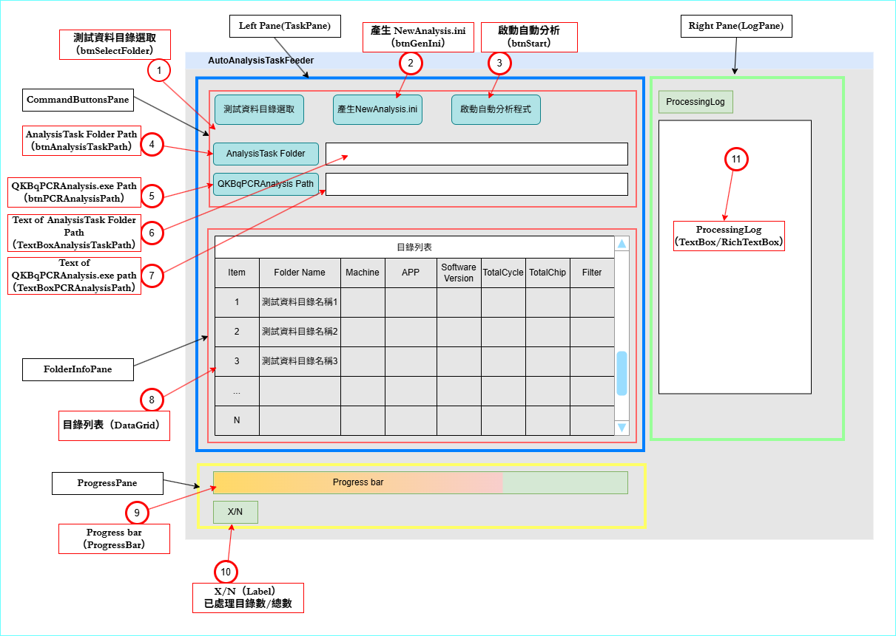
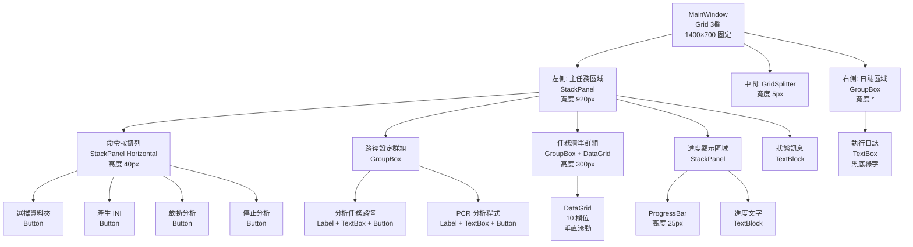

# AutoAnalysisTaskFeeder（WPF）規格書

> 目的：建立自動化解析實驗資料後生成 Analysis 程式執行所需的 ini 檔案，並能自動啟動分析程式、監視分析結束狀態，持續匯入下一筆 ini 檔，直到所有實驗資料分析完成。  
> 框架：.NET 6/8 + WPF + MVVM（CommunityToolkit.Mvvm）

---

## 1. 文件資訊

- **版本**：v1.0  
- **日期**：2026/01/21  
- **作者**：Albert Ke

### 1.1 名詞定義及說明

#### 1.1.1 AnalysisTask 目錄

目錄位置為 `分析任務路徑` 文字框內所顯示的字串。可由使用者按下 `瀏覽...` 按鈕選取目錄後自動帶入，或由使用者自行輸入。

目錄架構如下：
```text
\AnalysisTask/
 ├─ Complete/
 ├─ History/
 └─ New/
```

- `New`：將 `NewAnalysis.ini` 放入此目錄後會觸發分析程式 `QKBqPCRAnalysis.exe` 對實驗資料進行分析。
- `Complete`：分析完成後，分析程式會將 INI 檔案重命名為 `CompleteAnalysis.ini` 並搬移至此目錄，約 3 分鐘後再移至 `History`。
- `History`：用來記錄已完成的分析資料（本程式不使用此目錄，但需保留以符合外部程式行為）。

#### 1.1.2 QKBqPCRAnalysis.exe

實驗資料分析所需程式。路徑為 `PCR 分析程式` 文字框內所顯示的字串，可由 `瀏覽...` 按鈕選取後帶入，或由使用者自行輸入。

執行後（依外部程式行為）會清除 `New` 與 `Complete` 內檔案，並監控 `New` 目錄下是否出現新的 `NewAnalysis.ini`。

**管理員權限優化**：
- 本應用程式透過 `app.manifest` 要求管理員權限啟動
- 啟動時會彈出一次 UAC 提示，使用者輸入管理員密碼後，本應用程式以管理員權限執行
- 當本應用程式啟動 QKBqPCRAnalysis.exe 時，子程序會自動繼承父程序的管理員權限
- **優點**：整個批次過程（即使啟動多次 QKBqPCRAnalysis.exe），使用者只需在開始時輸入一次管理員密碼

#### 1.1.3 NewAnalysis.ini（由本程式產生）

完整格式定義：
```ini
[Information]
Enabled=1
TotalCycle=<整數，範圍 1~100>
Flag=0
TotalChip=<整數，6>
Path=<實驗資料目錄完整路徑>
User=<使用者名稱>
Filter=<篩選器，格式如 FAM::ROX: 或 FAM:HEX:ROX:CY5:>
```

**動態欄位讀取與計算規則：**

- **`TotalCycle`**  
  - 來源：實驗目錄下 `PROG_*.ini` 檔案內 `[qPCRSetting]` 段的 `Cycle` 鍵值
  - 搜尋規則：glob 模式 `PROG_*.ini`（UTF-8 編碼，大小寫敏感），若多筆存在取修改時間最新者
  - 值型別：整數（若非整數或無此鍵則記錄 WARN，填 0）
  - 值域驗證：1~100（超出範圍記錄 WARN，採用實際值）
  - 範例：`Cycle = 40` → `TotalCycle=40`

- **`TotalChip`**  
  - 來源：實驗目錄下 `*_Note.json` 檔案（UTF-8 編碼）的 `"Filter Selection"` 陣列長度
  - 搜尋規則：glob 模式 `*_Note.json`（大小寫敏感），若多筆存在取修改時間最新者
  - 計算邏輯：`TotalChip = $["Filter Selection"].Count()`
  - 邊界情況：若陣列為空或缺失，記錄 ERROR，填 0，跳過該任務
  - 實際範例：陣列長度為 6 → `TotalChip=6`

- **`Filter`**  
  - 來源：同一份 `*_Note.json` 的 `"Filter Selection"[0]`（第一個元素）
  - 轉換邏輯：`raw = $["Filter Selection"][0]` → `Filter = NormalizeFilter(raw)`
  - **NormalizeFilter 演算法**：將尾端連續的 `:` 合併為單個 `:` 
    ```
    NormalizeFilter(raw):
      result = raw.TrimEnd()
      while result.EndsWith("::"):
        result = result.Substring(0, result.Length - 1)
      return result
    ```
    - 範例 1：`"FAM::ROX::"` → `"FAM::ROX:"`
    - 範例 2：`"FAM:HEX:ROX:CY5:"` → `"FAM:HEX:ROX:CY5:"`（已是單冒號結尾）
    - 範例 3：`"FAM::ROX:::"` → `"FAM::ROX:"`（多重尾端冒號）
    - 邊界：若 raw 為 null 或空字串，填 "" 或記錄 WARN
  - 實際範例：`"FAM::ROX::"` → `Filter=FAM::ROX:`；`"FAM:HEX:ROX:CY5:"` → `Filter=FAM:HEX:ROX:CY5:`

- **`Path`**  
  - 來源：使用者按下 `選擇資料夾` 按鈕選取之實驗資料目錄完整路徑
  - 格式：Windows 路徑（支援長路徑 32767 字符、中文、特殊字符）
  - 範例：`E:\QuarkBio\JobData\Test_Data\Admin\202411111428_QSR2007_QSR2007-FQC1 test`

- **`User`**  
  - 來源：`*_Note.json` 的 `"User Name"` 字串
  - 範例：`"Admin"`
  - 若缺失：填 "Unknown" 並記錄 WARN

- **`Enabled` 和 `Flag`**  
  - 固定值：`Enabled=1`，`Flag=0`（本程式不修改）

#### 1.1.4 ProcessingLog

用來顯示程式執行過程的 log 訊息，以利除錯與追蹤外部程式執行狀態。

---

## 2. 系統範圍與成功標準

- **範圍**：設定路徑（AnalysisTask / QKBqPCRAnalysis.exe）→ 選取實驗資料目錄 → 建立任務清單 → 產生 `NewAnalysis.ini` → 啟動分析(QKBqPCRAnalysis.exe) → 監看Complete目錄確認分析是否完成 → 關閉分析(QKBqPCRAnalysis.exe) → 顯示進度與 Log
- **不在範圍**：分析演算法本體（本程式僅負責觸發/監控/關閉）
- **驗收**：主流程可完成、UI 不凍結、錯誤可追蹤（Log + 提示）

---

## 3. 技術與架構

### 3.1 技術棧

- **模式**：MVVM  
  - View：MainWindow.xaml  
  - ViewModel：MainViewModel  
  - Service：FolderScanService / IniService / ProcessRunner / LogService
- **執行緒**：掃描/分析使用 `Task`，以 `IProgress` 或 `Dispatcher` 更新 UI
- **資料繫結**：`ObservableCollection` + `ICommand`（RelayCommand / AsyncRelayCommand）

### 3.2 NuGet 套件依賴

- `CommunityToolkit.Mvvm` v8.2.2+ - MVVM 框架支援
- `Ookii.Dialogs.Wpf` v5.0.1+ - 多選資料夾對話框

---

## 4. UI 佈局規格



### 4.1 視窗配置（MainWindow）

- **視窗標題**：AutoAnalysisTaskFeeder
- **視窗大小**：1400 x 700（固定大小）
- **ResizeMode**：CanMinimize（可最小化，但不可調整大小）
- **WindowStartupLocation**：CenterScreen
- **背景色**：#F5F5F5

### 4.2 版面結構

整體結構：3 欄 Grid 配置
- 左側（Grid.Column="0"）：寬度 920px（固定）- 主任務區域
- 中間（Grid.Column="1"）：寬度 5px - GridSplitter
- 右側（Grid.Column="2"）：寬度 * - 日誌區域



#### 左側主任務區域（StackPanel）

由上至下依序包含：

1. **命令按鈕列**（StackPanel Horizontal，高度 40px）
   - `選擇資料夾` 按鈕（背景色 #007ACC，白色文字）
   - `產生 INI` 按鈕（背景色 #107C10，白色文字）
   - `啟動分析` 按鈕（背景色 #D13438，白色文字）
   - `停止分析` 按鈕（背景色 #D83B01，白色文字）

2. **路徑設定群組**（GroupBox，標題 "路徑設定"）
   - **分析任務路徑行**：
     - 標籤：`分析任務路徑:`
     - 文字框：雙向繫結至 `AnalysisTaskPath`
     - 按鈕：`瀏覽...`（寬度 70px）
   - **PCR 分析程式行**：
     - 標籤：`PCR 分析程式:`
     - 文字框：雙向繫結至 `PcrAnalysisExePath`
     - 按鈕：`瀏覽...`（寬度 70px）

3. **任務清單群組**（GroupBox，標題動態繫結 "任務清單 ({TotalCount} 項)"）
   - 高度：300px（固定）
   - DataGrid：
     - AutoGenerateColumns：False
     - IsReadOnly：True
     - GridLinesVisibility：All
     - HorizontalScrollBarVisibility：Disabled
     - VerticalScrollBarVisibility：Auto
     - 資料來源：繫結至 `Tasks`

4. **進度顯示區域**（StackPanel）
   - 標籤：`進度`（粗體）
   - ProgressBar：高度 25px，繫結至 `ProgressValue`
   - 進度文字：`已處理: {ProcessedCount} / 總計: {TotalCount}`

5. **狀態訊息**（TextBlock）
   - 繫結至 `StatusMessage`
   - 字體大小：12
   - 前景色：#333333

#### 右側日誌區域（GroupBox）

- **標題**：執行日誌
- **內容**：TextBox
  - 繫結至 `LogText`
  - IsReadOnly：True
  - VerticalScrollBarVisibility：Auto
  - HorizontalScrollBarVisibility：Auto
  - FontFamily：Courier New
  - FontSize：10
  - 背景色：#1E1E1E
  - 前景色：#00FF00

### 4.3 DataGrid 欄位定義

| 欄位名稱 | Binding | 寬度 | 說明 |
|---------|---------|------|------|
| 序號 | Item | 50 | 任務編號 |
| 資料夾名稱 | FolderName | 150 | 實驗資料夾名稱 |
| 機器 | Machine | 80 | 機器代碼 |
| APP名稱 | App | 100 | 應用程式名稱 |
| 軟體版本 | SoftwareVersion | 80 | 軟體版本 |
| 循環 | TotalCycle | 50 | 總循環數 |
| 晶片數 | TotalChip | 50 | 晶片總數 |
| 濾鏡名稱 | Filter | 100 | 篩選器配置 |
| 狀態 | Status | 80 | 任務狀態 |
| 錯誤 | ErrorMessage | 150 | 錯誤訊息 |

### 4.4 按鈕樣式

**通用彩色按鈕樣式**（ColoredButtonStyle）：
- 圓角：3px
- 按下時（IsPressed）：背景色變為 #333333（深灰色）
- 禁用時（IsEnabled=False）：透明度 0.5
- 滑鼠懸停時（IsMouseOver）：透明度 0.9

**停止按鈕樣式**（StopButtonStyle）：
- 與通用樣式相同
- 禁用時仍保持原始顏色和文字可見性

---

## 5. 資料模型（TaskItem）

### 5.1 欄位定義

#### 顯示於 UI 的欄位

- `Item`（int）：序號
- `FolderName`（string）：資料夾名稱
- `FolderPath`（string）：資料夾完整路徑
- `Machine`（string）：機器代碼（來自 JSON `"Machine Code"`）
- `App`（string）：應用名稱（來自 JSON `"Program Name"`）
- `SoftwareVersion`（string）：軟體版本（來自 JSON `"Software Version"`）
- `UserName`（string）：使用者名稱（來自 JSON `"User Name"`）
- `TotalCycle`（int）：總循環次數（來自 INI `[qPCRSetting] Cycle`）
- `TotalChip`（int）：晶片總數（來自 JSON `"Filter Selection"` 陣列長度）
- `Filter`（string）：篩選器配置（來自 JSON `"Filter Selection"[0]` 經 NormalizeFilter）

#### 內部狀態欄位

- `Status`（TaskStatus 列舉）：任務狀態
- `ErrorMessage`（string?）：錯誤訊息
- `IniFilePath`（string?）：已產生的 INI 檔案完整路徑
- `GeneratedTime`（DateTime?）：INI 產生時間
- `CompletedTime`（DateTime?）：分析完成時間
- `ProcessId`（int?）：外部程式進程 ID

### 5.2 TaskStatus 列舉

```csharp
public enum TaskStatus
{
    Pending = 0,          // 初始狀態，未處理
    Generating = 1,       // 正在產生 INI
    IniGenerated = 2,     // INI 已產生，待執行
    Running = 3,          // 正在執行分析
    Completed = 4,        // 分析完成
    Failed = 5            // 失敗（含產生失敗與執行失敗）
}
```

### 5.3 資料來源與填充流程

#### 掃描與解析邏輯

1. 使用者選取一或多個資料夾（支援多選）
2. 對每個資料夾掃描以下檔案：
   - `PROG_*.ini`（glob 模式，大小寫敏感）
   - `*_Note.json`（glob 模式，大小寫敏感）
3. 掃描範圍：**單層目錄**（不遞迴子資料夾）
4. 若某資料夾不存在或無讀取權限，記錄 ERROR，跳過該資料夾

#### 欄位解析規則

- `FolderName`：資料夾名稱（Path.GetFileName）
- `Machine`：讀取 `*_Note.json`→`"Machine Code"`；若不存在則填 "N/A"，記錄 WARN
- `App`：讀取 `*_Note.json`→`"Program Name"`；若不存在則填 "N/A"，記錄 WARN
- `SoftwareVersion`：讀取 `*_Note.json`→`"Software Version"`；若不存在則填 "N/A"，記錄 WARN
- `UserName`：讀取 `*_Note.json`→`"User Name"`；若不存在則填 "Unknown"，記錄 WARN
- `TotalCycle`：讀取 `PROG_*.ini`→`[qPCRSetting] Cycle`
  - 多筆檔案處理：若目錄內有多個 `PROG_*.ini`，取修改時間（LastWriteTime）最新的；記錄 WARN
  - 值驗證：檢查是否整數、是否在 1~100 之間；若格式錯誤則填 null，記錄 WARN
- `TotalChip`：讀取 `*_Note.json`→`"Filter Selection"` 陣列長度
  - 多筆檔案處理：若目錄內有多個 `*_Note.json`，取修改時間最新的；記錄 WARN
  - 值驗證：若陣列為空或缺失，填 null，記錄 ERROR
- `Filter`：讀取 `*_Note.json`→`"Filter Selection"[0]`，經 NormalizeFilter 轉換
  - 邊界：若陣列為空或缺失，填 ""，記錄 WARN

#### 累加模式支援

- 執行 `SelectFolderCommand` 時，若 Tasks 非空，呈現確認對話框：
  - "現有列表包含 {N} 個任務。選擇「是」清除現有任務，選擇「否」累加新任務到列表"
  - **是**：清除現有 Tasks，重置計數器
  - **否**：保留現有 Tasks，新掃描的任務序號從 currentCount+1 開始
  - **取消**：中止操作

#### 刷新時機與失敗處理

- 單一資料夾解析失敗時，該筆以 Status=Failed、ErrorMessage=失敗原因 標記；不中斷其他資料夾的掃描
- 所有資料夾都掃描完畢後，統計結果：成功數 / 失敗數 / 總數
- 若全部失敗，維持空清單，呈現 MessageBox："無法解析任何選取的資料夾。詳見 Log。"
- 若部分失敗，呈現 MessageBox："成功: {M}，失敗: {N-M}。詳見 Log。"
- 成功的任務 Status 初始化為 `Pending`，等待後續 GenerateIni 或 StartAnalysis 命令

---

## 6. 命令與互動規格

### 6.1 命令清單

- `SelectFolderCommand`（選擇資料夾 按鈕）
- `GenerateIniCommand`（產生 INI 按鈕）
- `StartAnalysisCommand`（啟動分析 按鈕）
- `StopAnalysisCommand`（停止分析 按鈕）
- `SelectAnalysisTaskPathCommand`（分析任務路徑 瀏覽... 按鈕）
- `SelectPcrAnalysisPathCommand`（PCR 分析程式 瀏覽... 按鈕）

### 6.2 主流程（Happy Path）

1. 設定 `AnalysisTaskPath` 與 `PcrAnalysisExePath`（可由按鈕選取或手動輸入）
2. SelectFolder → 掃描/解析 → 填入 DataGrid → 設定 TotalCount
3. GenerateIni → 依選取列（或全部）產生 ini → 更新 Status
4. StartAnalysis → 逐筆投遞 `NewAnalysis.ini` 至 `AnalysisTask\New` → 監控外部程式處理結果 → 更新 Progress + Log → 完成後彙總

### 6.3 命令執行細節

#### SelectFolderCommand（選擇資料夾）

**前置條件**：無

**執行流程**：
1. 若 Tasks 非空，呈現確認對話框：
   - "現有列表包含 {N} 個任務。選擇「是」清除現有任務，選擇「否」累加新任務到列表"
   - 若選擇「是」且有已生成 INI 的任務，再次詢問："部分任務已生成 INI，是否同時刪除 INI 檔案？"
   - 若選擇「取消」，中止操作
2. 開啟資料夾選擇對話框（使用 Ookii.Dialogs.Wpf.VistaFolderBrowserDialog，支援多選）
3. 設定初始目錄為上次選擇的路徑（從 UserSettings 載入）
4. 若使用者取消選擇，無動作
5. 執行後台掃描任務：
   - 遍歷所有選取的資料夾
   - 解析每個資料夾（參照 5.3 欄位解析規則）
   - 若為累加模式，調整新任務的序號
6. 掃描完畢，統計結果並更新 UI：
   - 全成功：呈現 MessageBox "成功載入 {N} 個資料夾"
   - 全失敗：呈現 MessageBox "無法解析任何選取的資料夾。詳見 Log。"
   - 部分失敗：呈現 MessageBox "成功: {M}，失敗: {N-M}。詳見 Log。"
7. 儲存選擇的目錄到 UserSettings

**可用性**：IsBusy=true 時停用

**Log 記錄**：
- `[INFO] 已選取 {資料夾數量} 個資料夾`
- `[INFO] 掃描資料夾開始`
- `[INFO] 掃描完畢: 成功 {M}，失敗 {N-M}，總計 {N} 個任務`
- 每個失敗項目記錄 `[WARN/ERROR] 解析失敗: {資料夾路徑} - {原因}`

#### GenerateIniCommand（產生 INI）

**前置條件**：Tasks 中至少有一筆 Status=Pending 或 IniGenerated 的任務

**執行流程**：
1. 檢查前置條件：Tasks 非空
2. 若無選取列，預設選取全部 Tasks；若有選取列，僅處理選取的列
3. 遍歷待處理的 Tasks，逐筆執行：
   - 更新 Status = Generating
   - 讀取 JSON/INI 檔案，解析 TotalCycle / TotalChip / Filter
   - 構建 NewAnalysis.ini 內容
   - 寫入至實驗目錄根目錄：`{FolderPath}\NewAnalysis.ini`
   - 若寫入成功：
     - 更新 Status = IniGenerated
     - 記錄 IniFilePath = `{FolderPath}\NewAnalysis.ini`
     - 記錄 GeneratedTime = DateTime.Now
     - 記錄 Log `[INFO] INI 已產生: {FolderPath}\NewAnalysis.ini`
   - 若寫入失敗：
     - 更新 Status = Failed、ErrorMessage=具體原因
     - 記錄 Log `[ERROR] INI 產生失敗: {FolderPath} - {異常訊息}`
4. 全部任務處理完畢，統計結果並呈現 MessageBox：
   - 全成功："已成功產生 {N} 份 INI"
   - 全失敗："無法產生任何 INI。詳見 Log。"
   - 部分失敗："成功: {M}，失敗: {N-M}。詳見 Log。"

**可用性**：IsBusy=true 時停用

#### StartAnalysisCommand（啟動分析）

**前置條件**：
- 至少一筆 Status=IniGenerated 的任務
- `PcrAnalysisExePath` 存在且副檔名 .exe
- `AnalysisTaskPath` 驗證通過

**執行流程**（同步逐筆執行）：
1. 篩選 Status=IniGenerated 的任務清單，按 Item 順序排列
2. 若清單為空，呈現 MessageBox "沒有待執行的任務。請先產生 INI。"，中止
3. 設定 IsBusy=true，StatusMessage="Running"，IsAnalysisRunning=true
4. 對每一筆任務執行以下步驟：

   **4.1 準備階段**：
   - 更新 Status = Running
   - 記錄 Log `[INFO] 執行任務 {Item}/{TotalCount}: {FolderName}...`

   **4.2 啟動外部程式**：
   - 呼叫 `Process.Start(PcrAnalysisExePath)` 啟動 QKBqPCRAnalysis.exe
   - 檢查程式啟動是否成功（若異常，記錄 ERROR Log，該任務標記為 Failed，繼續下一筆）
   - 記錄進程 ID 至 ProcessId
   - 記錄 Log `[INFO] 已啟動 QKBqPCRAnalysis.exe (PID={ProcessId})`
   - 等待 2 秒讓外部程式完成初始化和目錄清空動作
   - 記錄 Log `[INFO] 外部程式就緒，目錄已清空`

   **4.3 投遞 INI 檔案**：
   - 將 `{FolderPath}\NewAnalysis.ini` 複製至 `AnalysisTaskPath\New\NewAnalysis.ini`
   - 若複製失敗，記錄 ERROR Log，該任務標記為 Failed，關閉程式進程，繼續下一筆
   - 記錄 Log `[INFO] 已投遞 INI: {FolderName}`

   **4.4 監控完成**：
   - 進入監控迴圈：每 500ms 檢查一次
   - 主要監控：檢查 `AnalysisTaskPath\Complete\CompleteAnalysis.ini` 是否存在
     - 檔案完成判定：檔案存在 + 修改時間戳連續 1 秒無變化（表示寫入完成）
   - 次要監控：檢查 Process 狀態
     - 若 `Process.HasExited = true`：檢查 ExitCode
       - ExitCode = 0 且 INI 已移至 Complete → 正常完成
       - ExitCode ≠ 0 或 INI 未移至 Complete → State Machine 發生錯誤，標記為 Failed
   - 超時時間：15 分鐘（單筆任務，900 秒）
   - 成功情境（檔案成功移至 Complete）：
     - 更新 Status = Completed、CompletedTime = DateTime.Now
     - ProcessedCount += 1，更新 ProgressBar
     - 記錄 Log `[INFO] 任務完成: {FolderName} (耗時 {耗時秒數}s)`
   - 失敗情境：
     - 若 Process 意外終止：記錄 ERROR Log，標記為 Failed
     - 若監控超時：記錄 ERROR Log，標記為 Failed

   **4.5 關閉程式**：
   - 呼叫 `Process.Kill()` 強制終止 QKBqPCRAnalysis.exe 程序
   - 若程序已意外結束（HasExited=true），跳過此步驟
   - 等待程序完全終止（最多 5 秒）
   - 記錄 Log `[INFO] 已關閉 QKBqPCRAnalysis.exe`
   - 繼續下一筆任務（重複步驟 4.1-4.5）

5. 全部任務執行完畢：
   - 統計結果：成功數 / 失敗數 / 總數
   - 設定 IsBusy=false，IsAnalysisRunning=false
   - 若全成功：StatusMessage="Completed"，呈現 MessageBox "已完成分析 {N} 筆任務"
   - 若全失敗：StatusMessage="Error"，呈現 MessageBox "所有任務均失敗。詳見 Log。"
   - 若部分失敗：StatusMessage="Completed (with errors)"，呈現 MessageBox "成功: {M}，失敗: {N-M}。詳見 Log。"
   - 記錄 Log `[INFO] 分析流程完畢: 成功 {M}，失敗 {N-M}，耗時 {總耗時}s`

**可用性**：IsBusy=true 時停用；IsAnalysisRunning=true 時停用

#### StopAnalysisCommand（停止分析）

**前置條件**：IsAnalysisRunning=true

**執行流程**：
1. 呈現確認對話框："是否中止分析？當前任務將標記為取消。" (Yes / No)
2. 若使用者選擇 Yes：
   - 設定取消令牌（CancellationToken）
   - 記錄 Log `[INFO] 已中止分析 (使用者按取消)`
   - 立即結束當前外部程式進程
   - 停止監控迴圈
   - 更新 Status="Cancelled"、StatusMessage="Cancelled"
   - 設定 IsBusy=false，IsAnalysisRunning=false
3. 若使用者選擇 No：繼續執行

**可用性**：IsAnalysisRunning=true 時啟用

#### SelectAnalysisTaskPathCommand（選擇分析任務路徑）

**執行流程**：
1. 開啟資料夾選取對話框
2. 將選取結果寫入 `AnalysisTaskPath`
3. 驗證路徑合法性：
   - 路徑必須存在
   - 路徑必須具備讀取與寫入權限
   - 必須包含 New / Complete / History 三個子資料夾（若缺失，提示是否自動建立）
4. 儲存路徑到 UserSettings

**可用性**：IsBusy=true 時停用

#### SelectPcrAnalysisPathCommand（選擇 PCR 分析程式路徑）

**執行流程**：
1. 開啟檔案選取對話框（Filter: `*.exe`）
2. 將選取結果寫入 `PcrAnalysisExePath`
3. 驗證檔案合法性：
   - 檔案必須存在
   - 副檔名必須為 `.exe`
   - 檔案必須具備讀取權限與執行權限
4. 儲存路徑到 UserSettings

**可用性**：IsBusy=true 時停用

---

## 7. 狀態與可用性規則

### 7.1 按鈕可用性條件

| 按鈕 | 可用條件 |
|------|---------|
| 選擇資料夾 | !IsBusy |
| 產生 INI | !IsBusy && Tasks.Count > 0 |
| 啟動分析 | !IsBusy && !IsAnalysisRunning && Tasks.Any(t => t.Status == IniGenerated) && IsAnalysisTaskPathValid && IsPcrAnalysisExePathValid |
| 停止分析 | IsAnalysisRunning |
| 分析任務路徑 瀏覽... | !IsBusy |
| PCR 分析程式 瀏覽... | !IsBusy |

### 7.2 路徑驗證與即時更新

#### AnalysisTaskPath 驗證

驗證時機：TextBox 失焦或按鈕變更後觸發

驗證規則：
1. 路徑存在性：若路徑不存在，提示 "路徑不存在"
2. 寫入權限：測試在路徑下建立臨時檔案；若失敗，提示 "無寫入權限"
3. 子資料夾檢查：檢查 New / Complete / History 是否存在；若缺失，提示 "子資料夾不完整"，可點選自動建立
4. 驗證成功：恢復 StartAnalysisCommand 可用性（若其他條件也滿足）

#### PcrAnalysisExePath 驗證

驗證時機：TextBox 失焦或按鈕變更後觸發

驗證規則：
1. 檔案存在性：若不存在，提示 "檔案不存在"
2. 副檔名驗證：若副檔名非 `.exe`，提示 "副檔名無效"
3. 執行權限：檢查檔案是否可執行
4. 驗證成功：恢復 StartAnalysisCommand 可用性（若其他條件也滿足）

---

## 8. Log 規格（ProcessingLog）

### 8.1 格式與等級

- 控制項：TextBox（只讀）
- 時間戳格式：`[HH:mm:ss.fff]`（本地時間，精確到毫秒）
- 訊息格式：`[HH:mm:ss.fff] [LEVEL] message`
- 等級：
  - `INFO`：正常流程進度
  - `WARN`：非致命警告
  - `ERROR`：致命錯誤，任務失敗

### 8.2 日誌內容範例

#### SelectFolder 流程
```
[INFO] 掃描資料夾開始: {資料夾數量}
[INFO] 掃描資料夾: {資料夾路徑}
[WARN] 多筆 PROG_*.ini，採用最新版本: {檔名}
[WARN] 多筆 *_Note.json，採用最新版本: {檔名}
[WARN] 無法讀取 Machine Code，使用預設值 "N/A"
[ERROR] 解析失敗: {資料夾路徑} - {具體原因}
[INFO] 掃描完畢: 成功 {N}，失敗 {M}，耗時 {秒數}s
```

#### GenerateIni 流程
```
[INFO] 開始產生 INI: 目標 {數量} 個任務
[INFO] 正在產生 INI: {FolderName}
[INFO] INI 已產生: {FolderPath}\NewAnalysis.ini
[ERROR] INI 產生失敗: {FolderPath} - {原因}
[INFO] INI 產生完畢: 成功 {N}，失敗 {M}，耗時 {秒數}s
```

#### StartAnalysis 流程
```
[INFO] 執行分析開始: {待執行任務數} 個任務
[INFO] 執行任務 {Item}/{Total}: {FolderName}...
[INFO] 已啟動 QKBqPCRAnalysis.exe (PID={ProcessId})
[INFO] 外部程式就緒，目錄已清空
[INFO] 已投遞 INI: {FolderName}
[INFO] 監控中: {FolderName} (已等待 {秒數}s / 900s)
[INFO] 任務完成: {FolderName} (耗時 {秒數}s)
[ERROR] 監控超時: {FolderName} (15 分鐘內未完成)
[ERROR] 程式異常終止: {FolderName} (ExitCode={ExitCode})
[INFO] 已關閉 QKBqPCRAnalysis.exe
[INFO] 分析流程完畢: 成功 {N}，失敗 {M}，耗時 {總秒數}s
```

### 8.3 Log 容量與滾動管理

- **容量上限**：5000 行
- **超出上限處理**：採 FIFO 策略，自動刪除最舊的 500 行；刪除時在 Log 開頭插入訊息 `[INFO] [Log truncated: oldest 500 lines removed]`
- **自動捲動**：每次新增訊息後自動捲到底部（TextBox.ScrollToEnd()）
- **複製與選取**：允許使用者選取與複製 Log 內容

---

## 9. 檔案/路徑與外部程式

### 9.1 使用者設定記憶功能（UserSettings）

**功能說明**：自動記憶並恢復使用者上次選擇的目錄和檔案路徑，提升使用體驗。

- **設定檔案位置**：`%LocalAppData%\AutoAnalysisTaskFeeder\user_settings.json`
- **儲存內容**：
  - `LastAnalysisTaskPath`：上次選擇的 AnalysisTask 目錄
  - `LastPcrAnalysisExePath`：上次選擇的 QKBqPCRAnalysis.exe 檔案路徑
  - `LastExperimentDataPath`：上次選擇實驗資料目錄的父目錄
- **儲存格式**：JSON（UTF-8，人類可讀）
- **載入時機**：應用程式啟動時自動載入
- **儲存時機**：
  - 選擇 AnalysisTask 目錄後立即儲存
  - 選擇 QKBqPCRAnalysis.exe 檔案後立即儲存
  - 選擇實驗資料目錄後立即儲存
- **恢復行為**：
  - 啟動時自動填入文字框
  - 開啟資料夾選擇對話框時，自動定位到上次選擇的目錄
- **錯誤處理**：若設定檔案讀取失敗或路徑不存在，使用空白預設值

### 9.2 AnalysisTaskPath（分析工作目錄）

- **路徑位置**：由文字框指定；可由按鈕選取或手動輸入
- **目錄結構**（必須）：
  ```text
  AnalysisTask/
  ├─ New/        （放入 NewAnalysis.ini 供外部程式讀取）
  ├─ Complete/   （外部程式將完成的 INI 重命名為 CompleteAnalysis.ini 並移至此）
  └─ History/    （外部程式將 Complete 內的 INI 進一步移至此，本程式不使用）
  ```
- **外部程式行為**：
  - QKBqPCRAnalysis.exe 啟動時會自動清空所有子目錄內的 ini 檔案
  - 此行為確保每次啟動時從乾淨狀態開始處理任務
  - 因此本程式必須在外部程式啟動並完成清空後，才能投遞 INI 檔案至 New 目錄
- **檔案操作**：
  - 本程式將產生的 NewAnalysis.ini 複製至 New 目錄
  - 本程式監控 Complete 目錄以判斷任務完成
  - 本程式不涉及 History，但必須存在（外部程式依賴）
- **權限需求**：讀取 + 寫入 + 刪除
- **路徑支援**：
  - Windows 本地路徑（如 `C:\AnalysisTask\`）
  - UNC 網路路徑（如 `\\server\share\AnalysisTask\`）
  - 長路徑（最長 32767 字符）
  - 中文與特殊字符（UTF-8 編碼）

### 9.3 PCRAnalysisExePath（外部分析程式）

- **檔案位置**：由文字框指定；可由按鈕選取或手動輸入
- **預期檔案**：`QKBqPCRAnalysis.exe`（或相容的可執行檔）
- **程式行為特性**：
  - 啟動時會自動清空 AnalysisTaskPath 下所有子目錄的 ini 檔案
  - 不會自動退出：完成分析並將 INI 重命名為 CompleteAnalysis.ini 移至 Complete 後，程式會持續運行
  - 每次任務都需要重新啟動：每個任務完成後需要關閉並重新啟動程式
  - 基於 LabVIEW State Machine 架構，發生錯誤時會立即停止（ExitCode ≠ 0）
- **檔案操作**：
  - 本程式呼叫 `Process.Start(PcrAnalysisExePath)` 啟動程式
  - 管理員權限處理：本應用程式透過 app.manifest 要求管理員權限，子程序自動繼承權限
  - 優點：整個批次過程（即使每次任務都重新啟動程式），使用者只需在應用程式啟動時輸入一次管理員密碼
  - 程式啟動後將自動監控 AnalysisTask\New 目錄，並在新檔案出現時執行分析
  - 分析完成後將 INI 檔案重命名為 CompleteAnalysis.ini 並移至 Complete，約 3 分鐘後再移至 History
  - 本程式必須在偵測到 Complete 有檔案後，立即呼叫 Process.Kill() 終止程式，並在下一筆任務時重新啟動
- **權限需求**：讀取 + 執行 + 管理員權限（UAC 提示）

### 9.4 NewAnalysis.ini（產生的任務檔案）

- **位置**：
  - 副本：`{ExperimentFolderPath}\NewAnalysis.ini`（本程式保存，供監控與重試）
  - 主檔：`{AnalysisTaskPath}\New\NewAnalysis.ini`（供外部程式讀取）
- **編碼**：UTF-8（無 BOM）
- **格式**（參照第 1 章）：
  ```ini
  [Information]
  Enabled=1
  TotalCycle=<整數>
  Flag=0
  TotalChip=<整數>
  Path=<實驗資料目錄完整路徑>
  User=<使用者名稱>
  Filter=<篩選器>
  ```

### 9.5 檔案相容性與路徑編碼

- **長路徑支援**：
  - Windows 10/11 上啟用 LongPathsEnabled 登錄設定（或使用 `\\?\` 前綴）
  - .NET 自動支援 32767 字符路徑（建議使用 `Path.GetFullPath()` 規格化）
- **中文路徑與特殊字符**：
  - 統一使用 UTF-8 編碼讀寫檔案
  - Path API 自動處理轉義（不需手動編碼）
  - 支援路徑中的空格、括弧、連字符等字符
- **權限異常處理**：
  - 捕獲 `UnauthorizedAccessException` → 提示 "路徑無寫入/讀取權限"
  - 捕獲 `DirectoryNotFoundException` → 提示 "路徑不存在"
  - 捕獲 `FileNotFoundException` → 提示 "檔案不存在"
  - 所有異常均記錄至 Log，包括完整的異常訊息與堆棧追蹤

---

## 10. 非功能性需求

### 10.1 效能與並行性

- **UI 不凍結**：所有長耗時操作必須執行於背景執行緒（Task），UI 執行緒僅負責更新控制項
- **並行性控制**：同時只能執行一個背景任務（SelectFolder / GenerateIni / StartAnalysis）；使用 `SemaphoreSlim(1, 1)` 確保互斥
- **IProgress 與 Dispatcher**：
  - 背景任務透過 `IProgress<T>` 回報進度與狀態變化
  - UI 更新統一透過 `Dispatcher.InvokeAsync()` 進行，確保執行緒安全
  - ObservableCollection 修改亦需 Dispatcher 同步

### 10.2 容錯與異常處理

- **檔案讀取異常**：
  - `FileNotFoundException` / `DirectoryNotFoundException` → 記錄 ERROR，任務標記為 Failed
  - `UnauthorizedAccessException` → 記錄 ERROR，提示無權限
  - `IOException`（檔案被佔用、磁碟讀寫失敗）→ 記錄 ERROR，重試 1 次後放棄
  - `JsonException`（JSON 格式錯誤）→ 記錄 ERROR，該欄位填 null，繼續掃描
- **外部程式異常**：
  - 程式啟動失敗 → 捕獲 `Win32Exception`，記錄 ERROR，任務標記為 Failed
  - 程式異常終止 → 監控進程 ExitCode，若非 0，記錄 ERROR，任務標記為 Failed
  - 進程無法終止 → 強制 Kill() 後繼續執行下一筆任務
- **路徑驗證失敗**：
  - 所有路徑驗證異常均捕獲並記錄 ERROR Log
  - 提供使用者友善的提示訊息

### 10.3 相容性與本地化

- **中文路徑**：支援實驗資料夾名稱、AnalysisTaskPath 中包含中文字符（UTF-8 編碼）
- **長路徑**：支援最長 32767 字符的路徑（啟用 Windows LongPathsEnabled）
- **UNC 路徑**：支援網路共享路徑（如 `\\server\share\AnalysisTask\`）
- **多國語言 UI**：當前版本為繁體中文
- **時區**：所有時間戳使用本地時區（不轉換為 UTC），便於使用者與外部程式對齊時間

### 10.4 安全性與隱私

- **檔案權限**：不改變檔案的原始權限設定，僅讀寫需要的 INI 檔案
- **臨時檔案**：產生的暫存檔案應在完成後立即刪除，不保留敏感資料
- **日誌隱私**：Log 中不記錄使用者密碼或敏感認證資訊，僅記錄操作事件與錯誤

---

## 11. ViewModel 欄位與命令（實現參考）

### 11.1 屬性（Properties）

#### 路徑與配置

- `string AnalysisTaskPath`（INotifyPropertyChanged）
  - 綁定至文字框，允許手動編輯
  - 變更時觸發路徑驗證
- `string PcrAnalysisExePath`（INotifyPropertyChanged）
  - 綁定至文字框，允許手動編輯
  - 變更時觸發路徑驗證

#### 任務與資料

- `ObservableCollection<TaskItem> Tasks`（readonly）
  - DataGrid 的資料來源
  - 初始為空集合

#### 進度與狀態

- `int TotalCount`（INotifyPropertyChanged）
  - 任務總數，即 Tasks.Count
- `int ProcessedCount`（INotifyPropertyChanged）
  - 已處理任務數（Completed + Failed）
- `double ProgressValue`（INotifyPropertyChanged）
  - 進度值 0~100
  - 計算公式：(ProcessedCount / TotalCount) * 100
- `bool IsBusy`（INotifyPropertyChanged）
  - 後台任務執行標誌
  - true 時禁用大部分命令按鈕
- `bool IsAnalysisRunning`（INotifyPropertyChanged）
  - 分析執行標誌
  - true 時啟用停止分析按鈕，禁用啟動分析按鈕
- `string StatusMessage`（INotifyPropertyChanged）
  - 狀態訊息，值為 "Ready" / "Running" / "Completed" / "Error" / "Cancelled"

#### 日誌

- `string LogText`（INotifyPropertyChanged）
  - ProcessingLog 的完整內容
  - 綁定至 TextBox（只讀）
  - 新訊息追加後自動捲到底部

### 11.2 命令（ICommand）

- `ICommand SelectFolderCommand`（AsyncRelayCommand）
  - 綁定至「選擇資料夾」按鈕
  - CanExecute：!IsBusy
- `ICommand GenerateIniCommand`（AsyncRelayCommand）
  - 綁定至「產生 INI」按鈕
  - CanExecute：!IsBusy && Tasks.Count > 0
- `ICommand StartAnalysisCommand`（AsyncRelayCommand）
  - 綁定至「啟動分析」按鈕
  - CanExecute：!IsBusy && !IsAnalysisRunning && Tasks.Any(t => t.Status == IniGenerated)
- `ICommand StopAnalysisCommand`（RelayCommand）
  - 綁定至「停止分析」按鈕
  - CanExecute：IsAnalysisRunning
- `ICommand SelectAnalysisTaskPathCommand`（RelayCommand）
  - 綁定至「分析任務路徑」瀏覽按鈕
  - CanExecute：!IsBusy
- `ICommand SelectPcrAnalysisPathCommand`（RelayCommand）
  - 綁定至「PCR 分析程式」瀏覽按鈕
  - CanExecute：!IsBusy

### 11.3 服務依賴

- `IFolderScanService`：封裝資料夾掃描與 TaskItem 解析邏輯
- `IIniService`：封裝 INI 讀寫邏輯
- `IProcessRunner`：封裝外部程式啟動與監控邏輯
- `ILogService`：封裝 Log 管理邏輯

---

## 附錄：總結

本規格書為 AutoAnalysisTaskFeeder 應用程式的完整技術規格，涵蓋：
- UI 佈局與控制項定義
- 資料模型與狀態管理
- 命令執行流程與互動邏輯
- 日誌規格與容量管理
- 檔案路徑處理與外部程式整合
- 非功能性需求（效能、容錯、相容性）

本規格書基於實際程式碼實現撰寫，所有控制項名稱、Binding、命令名稱、視窗大小等均與程式碼一致。

---

**END OF DOCUMENT**
